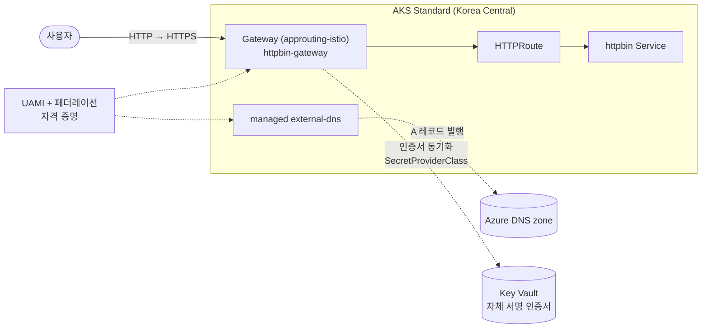

# AKS Application Routing Gateway API 핸즈온 워크숍

Azure Kubernetes Service(AKS)의 **Application Routing 애드온**과 **Gateway API**를 사용해 httpbin 샘플 앱을 HTTP로 노출하고, Azure DNS 및 Key Vault TLS까지 적용하는 실습형 워크숍입니다. 전 과정을 Azure Cloud Shell(bash)에서 `az` CLI와 `kubectl`만으로 진행하며, 코어 실습 시간은 약 **1시간 10분–1시간 30분**입니다.

---

## 아키텍처

---

## 학습 목표

1. Managed Gateway API CRD·Application Routing Gateway API·Workload Identity·Key Vault CSI 기능을 켠 AKS 클러스터를 `az` CLI로 생성한다.
2. Gateway와 HTTPRoute로 앱을 HTTP로 노출하고, 자동 생성되는 리소스(GatewayClass·LoadBalancer 서비스 등)의 동작을 이해한다.
3. HTTPRoute의 `hostname`·`path` 매칭 동작을 직접 관찰한다.
4. Azure DNS zone·Key Vault 인증서·UAMI·페더레이션 자격 증명(FIC)으로 operator 통합 인프라를 구성한다.
5. Gateway annotation 기반 TLS 종료와 ClusterExternalDNS를 통한 A 레코드 자동 발행을 확인한다.
6. 실습에 사용한 모든 Azure 리소스를 완전히 정리한다.

---

## 사전 요구사항

| 항목 | 최소 요건 |
|------|-----------|
| Azure 구독 | Owner 또는 (RBAC Administrator + Managed Identity Contributor) 역할 보유 |
| 터미널 | Azure Cloud Shell(bash) — 별도 설치 불필요 |
| az CLI | ≥ 2.86.0 (Cloud Shell 신규 세션에서 확인) |
| Kubernetes 기초 | 파드·서비스 개념 이해 |

---

## 모듈 목차

| 번호 | 제목 | 설명 |
|------|------|------|
| 01 | [사전 준비](docs/01-prerequisites.md) | Cloud Shell 접속, 구독 선택, az CLI 버전 확인 |
| 02 | [환경 준비](docs/02-environment-setup.md) | 리소스 그룹·AKS 클러스터 생성, 자격 증명 취득 |
| 03 | [Gateway·HTTPRoute로 HTTP 노출](docs/03-gateway-httproute.md) | Gateway·HTTPRoute 매니페스트 적용, LB IP 확인 및 동작 검증 |
| 04 | [DNS·TLS 인프라 준비](docs/04-dns-tls-infra.md) | DNS zone·Key Vault·UAMI·FIC 생성 및 RBAC 구성 |
| 05 | [TLS Gateway와 ClusterExternalDNS](docs/05-tls-gateway-externaldns.md) | TLS Gateway 적용, ClusterExternalDNS로 A 레코드 자동 발행 |
| 06 | [정리](docs/06-cleanup.md) | 전체 Azure 리소스 삭제 |

---

## 시간표

| 모듈 | 제목 | 예상 시간 | 주 소요 요인 |
|------|------|-----------|-------------|
| 01 | 사전 준비 | ~10분 | Cloud Shell 초기 로딩 |
| 02 | 환경 준비 | 15–20분 (AKS 생성 대기 5–10분 포함) | AKS 클러스터 프로비저닝 |
| 03 | Gateway·HTTPRoute로 HTTP 노출 | 10–15분 (LB IP 할당 대기 포함) | Azure LB 프로비저닝 |
| 04 | DNS·TLS 인프라 준비 | 15–20분 (RBAC 전파 대기 포함) | RBAC 전파 지연 |
| 05 | TLS Gateway와 ClusterExternalDNS | 15–20분 (인증서 동기화·A 레코드 생성 대기 포함) | Key Vault 동기화·DNS 전파 |
| 06 | 정리 | ~5분 (삭제는 백그라운드 진행) | — |
| **합계** | | **≈ 1시간 10분–1시간 30분** | |

*리허설 후 실측 보정 예정.*

---

## 비용 개요

실습 과정에서 생성되는 주요 과금 리소스는 다음과 같습니다.

| 리소스 | 사양 | 비고 |
|--------|------|------|
| AKS 노드 | Standard_D2s_v5 × 2 | 실습 1.5시간 기준 소액 |
| Azure Standard LB | — | Gateway 노출 시 자동 생성 |
| Azure DNS zone | — | 공개 zone 기준 |
| Azure Key Vault | — | 자체 서명 인증서 1건 |

실습 종료 후 반드시 **06 — 정리** 모듈을 실행해 모든 리소스를 삭제하세요.

---

## 트러블슈팅 색인

자주 발생하는 문제를 빠르게 찾을 수 있도록 각 모듈의 대표 증상을 아래에 정리합니다.

| 증상 | 모듈 |
|------|------|
| `az version` 결과가 2.86.0 미만 | [01 — 사전 준비](docs/01-prerequisites.md) |
| Cloud Shell 시작 시 스토리지 계정 오류 | [01 — 사전 준비](docs/01-prerequisites.md) |
| `--enable-app-routing-istio` unrecognized argument 오류 | [02 — 환경 준비](docs/02-environment-setup.md) |
| `Operation results in exceeding quota of cores` 오류 | [02 — 환경 준비](docs/02-environment-setup.md) |
| `EXTERNAL-IP`가 `<pending>` 상태로 계속 유지 | [03 — Gateway·HTTPRoute로 HTTP 노출](docs/03-gateway-httproute.md) |
| `kubectl wait` 명령이 타임아웃(`condition not met`) | [03 — Gateway·HTTPRoute로 HTTP 노출](docs/03-gateway-httproute.md) |
| `az keyvault certificate create` 실행 시 `ForbiddenByRbac(403)` 오류 | [04 — DNS·TLS 인프라 준비](docs/04-dns-tls-infra.md) |
| `az keyvault certificate create` 실행 시 `Public network access is disabled` 오류 | [04 — DNS·TLS 인프라 준비](docs/04-dns-tls-infra.md) |
| `az ad signed-in-user show` 명령이 오류를 반환하거나 값이 비어 있음 | [04 — DNS·TLS 인프라 준비](docs/04-dns-tls-infra.md) |
| `kv-gw-cert-*` Secret이 생성되지 않음 | [05 — TLS Gateway와 ClusterExternalDNS](docs/05-tls-gateway-externaldns.md) |
| `SecretProviderClass`·`clusterexternaldns` CRD 자체가 없음 | [05 — TLS Gateway와 ClusterExternalDNS](docs/05-tls-gateway-externaldns.md) |
| A 레코드가 생성되지 않음 | [05 — TLS Gateway와 ClusterExternalDNS](docs/05-tls-gateway-externaldns.md) |
| RG 삭제가 10분 이상 걸림 | [06 — 정리](docs/06-cleanup.md) |
| `az keyvault purge` 실행 시 권한 오류 발생 | [06 — 정리](docs/06-cleanup.md) |

---

## 참고 자료

- [AKS Application Routing — Gateway API 사용](https://learn.microsoft.com/en-us/azure/aks/app-routing-gateway-api)
- [AKS Application Routing — DNS·TLS 구성](https://learn.microsoft.com/en-us/azure/aks/app-routing-gateway-api-dns-tls)
- [AKS Managed Gateway API](https://learn.microsoft.com/en-us/azure/aks/managed-gateway-api)
- [Gateway API 공식 문서](https://gateway-api.sigs.k8s.io/)
