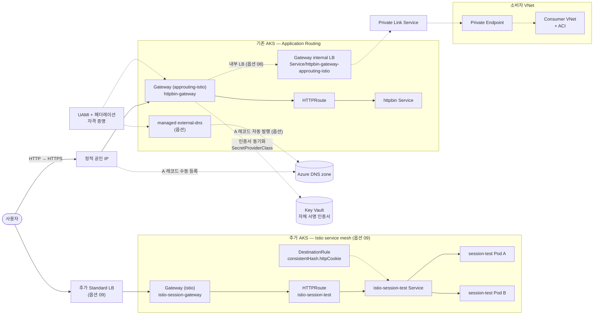

# AKS Application Routing Gateway API 핸즈온 워크숍

Azure Kubernetes Service(AKS)의 **Application Routing 애드온**과 **Gateway API**를 사용해 httpbin 샘플 앱을 HTTP로 노출하고, Azure DNS 및 Key Vault TLS까지 적용하는 실습형 워크숍입니다. 전 과정을 Azure Cloud Shell(bash)에서 `az` CLI와 `kubectl`만으로 진행하며, 코어 실습 시간은 약 **1시간 10분–1시간 30분**입니다.

07과 08은 기존 Application Routing 클러스터에서 수행하는 옵션이며, 09는 같은 리소스 그룹에 별도 Istio AKS 클러스터를 추가하는 독립 옵션입니다. 09는 02 이후 언제든 수행할 수 있고 07·08과 함께 진행해도 됩니다.

---

## 아키텍처

👁️ **예시** — 전체 아키텍처

---

## 학습 목표

1. Managed Gateway API CRD·Application Routing Gateway API·Workload Identity·Key Vault CSI 기능을 켠 AKS 클러스터를 `az` CLI로 생성한다.
2. Gateway와 HTTPRoute로 앱을 HTTP로 노출하고, 자동 생성되는 리소스(GatewayClass·LoadBalancer 서비스 등)의 동작을 이해하며, `spec.addresses`로 Gateway 외부 IP를 정적 공인 IP로 고정한다.
3. HTTPRoute의 `hostname`·`path` 매칭 동작을 직접 관찰한다.
4. Azure DNS zone·Key Vault 인증서·UAMI·페더레이션 자격 증명(FIC)으로 operator 통합 인프라를 구성한다.
5. Gateway annotation 기반 TLS 종료와 정적 IP 기반 A 레코드 등록을 확인한다. (옵션: ClusterExternalDNS를 통한 A 레코드 자동 발행)
6. (옵션) 자동 생성되는 Gateway 인프라(Service·Deployment·HPA·PDB)를 ConfigMap으로 재정의하고, Annotation으로 내부 Load Balancer 전환을 수행한다.
7. (옵션) Azure Front Door에서 TLS offloading을 구성하고, ingress-nginx와 Gateway API 데이터 플레인을 병렬 구성해 가중치 카나리 마이그레이션을 수행한다.
8. Gateway annotation이 generated Service에 전달되는지와 Private Link Service/Private Endpoint 연결을 검증한다.
9. (옵션) 같은 리소스 그룹에 Istio 전용 AKS 클러스터를 추가하고, `DestinationRule` 쿠키 consistent hash·`EnvoyFilter` 128 KiB 요청 본문 제한(128 KiB 허용·129 KiB는 `413`)·8/16/32 KiB 응답 헤더·본문을 관찰한다.
10. 실습에 사용한 모든 Azure 리소스를 완전히 정리한다.

---

## 사전 요구사항

| 항목 | 최소 요건 |
|------|-----------|
| Azure 구독 | Owner 또는 (RBAC Administrator + Managed Identity Contributor) 역할 보유 |
| 터미널 | Azure Cloud Shell(bash) — 별도 설치 불필요 |
| az CLI | ≥ 2.86.0 (Cloud Shell 신규 세션에서 확인) |
| Kubernetes 기초 | 파드·서비스 개념 이해 |

---

## 모듈 목차

| 번호 | 제목 | 설명 |
|------|------|------|
| 01 | [사전 준비](docs/01-prerequisites.md) | Cloud Shell 접속, 구독 선택, az CLI 버전 확인 |
| 02 | [환경 준비](docs/02-environment-setup.md) | 리소스 그룹·AKS 클러스터 생성, 자격 증명 취득 |
| 03 | [Gateway·HTTPRoute로 HTTP 노출](docs/03-gateway-httproute.md) | Gateway·HTTPRoute 매니페스트 적용, LB IP 확인·동작 검증, 정적 공인 IP 고정 |
| 04 | [DNS·TLS 인프라 준비](docs/04-dns-tls-infra.md) | DNS zone·Key Vault·UAMI·FIC 생성 및 RBAC 구성 |
| 05 | [TLS Gateway와 DNS A 레코드](docs/05-tls-gateway-externaldns.md) | TLS Gateway 적용, 정적 IP로 A 레코드 등록 (옵션: ClusterExternalDNS 자동 발행) |
| 06 | [Gateway 인프라 커스터마이징 (옵션)](docs/06-gateway-customizations.md) | ConfigMap으로 HPA·Deployment 재정의, Annotation으로 내부 LB 전환 |
| 07 | [AFD 카나리 마이그레이션 (옵션)](docs/07-afd-canary-migration.md) | AFD TLS offloading, ingress-nginx ∥ Gateway API 병렬 구성, 가중치 카나리로 무중단 이관 |
| 08 | [Gateway API Private Link Service 검증 (옵션)](docs/08-private-link-service.md) | Gateway annotation 전달과 Private Endpoint/ACI로 private data path 확인 |
| 09 | [Istio Gateway API 쿠키 일관 해시·응답 헤더·본문 검증 (옵션)](docs/09-istio-cookie-affinity.md) | 별도 Istio AKS 생성, DestinationRule 쿠키 일관 해시, EnvoyFilter 128 KiB 요청 본문 제한(128 KiB 허용·129 KiB `413`), 8/16/32 KiB 응답 헤더·본문 관찰 |
| 10 | [정리](docs/10-cleanup.md) | 전체 Azure 리소스 삭제 |

07과 08은 기존 Application Routing Gateway 상태를 변경하는 옵션입니다. 09는 별도 클러스터를 사용하므로 02 이후 독립적으로 수행할 수 있으며, 07·08 전후에도 실행할 수 있습니다.

09 옵션의 2026-08-13 Korea Central 검증에서는 큰 응답 헤더가 `8/16/32 KiB → 200 / 8192·16384·32768 bytes`, 큰 응답 본문이 `8/16/32 KiB → 200 / 8192·16384·32768 bytes`로 관찰됐습니다. 다만 이 고정 크기 본문 시험만으로 streaming 또는 busy-buffer semantics 전체가 증명되는 것은 아닙니다.

같은 검증에서 EnvoyFilter 128 KiB 요청 본문 제한도 확인했습니다. 128 KiB: status=200 received_bytes=131072, 129 KiB: status=413으로, 선택된 두 Gateway Pod 모두에 필터가 32초 만에 전파됐습니다.

---

## 시간표

| 모듈 | 제목 | 예상 시간 | 주 소요 요인 |
|------|------|-----------|-------------|
| 01 | 사전 준비 | 5–10분 | Cloud Shell 초기 로딩 |
| 02 | 환경 준비 | 15–20분 (AKS 생성 대기 5–10분 포함) | AKS 클러스터 프로비저닝 |
| 03 | Gateway·HTTPRoute로 HTTP 노출 | 15–20분 (LB IP 할당·정적 IP 구성 대기 포함) | Azure LB 프로비저닝 |
| 04 | DNS·TLS 인프라 준비 | 15–20분 (RBAC 전파 대기 포함) | RBAC 전파 지연 |
| 05 | TLS Gateway와 DNS A 레코드 | 10–15분 (인증서 동기화 대기 포함, ExternalDNS 옵션 +10분) | Key Vault 동기화 |
| 06 | Gateway 인프라 커스터마이징 (옵션) | 10–15분 | HPA 반영·내부 LB 재구성 대기 |
| 07 | AFD 카나리 마이그레이션 (옵션) | 50–90분 | AFD 라우트·가중치 변경 전파 대기 (회당 5–30분) |
| 08 | Gateway API Private Link Service 검증 (옵션) | 15–20분 (Private Endpoint 승인·ACI 통신 확인 대기 포함; 2026-08-11 리허설 실측: Gateway 패치→ACI HTTP 200 확인까지 순수 Azure 작업 시간 약 6분) | Private Endpoint 승인·ACI 통신 확인 |
| 09 | Istio Gateway API 쿠키 일관 해시·응답 헤더·본문 검증 (옵션) | 8–13분 (두 번째 AKS 클러스터 생성과 EnvoyFilter 전파 대기 포함; 2026-08-13 Korea Central 리허설 실측(128 KiB 제한 기준): 전체 약 8분(465초), 두 번째 클러스터 생성 348초, EnvoyFilter 전파 32초) | 두 번째 AKS 클러스터 생성 |
| 10 | 정리 | 5–10분 (RG 삭제 완료 대기 포함) | AKS 노드 RG 연쇄 삭제 |
| **합계** | | **≈ 1시간 10분–1시간 30분 (06 옵션 +10–15분, 07 옵션 +50–90분 또는 08 옵션 +15–20분, 09 옵션 +8–13분)** | |

---

## 비용 개요

실습 과정에서 생성되는 주요 과금 리소스는 다음과 같습니다.

| 리소스 | 사양 | 비고 |
|--------|------|------|
| AKS 노드 | Standard_D2s_v5 × 2 | 실습 1.5시간 기준 소액 |
| Azure Standard LB | — | Gateway 노출 시 자동 생성 |
| Azure DNS zone | — | 공개 zone 기준 |
| Azure Key Vault | — | 자체 서명 인증서 1건 |
| Azure Front Door Standard (옵션 07) | 기본요금 약 $35/월의 일할 + 요청·전송량 | 실습 1–1.5시간 기준 소액, 07 수행 시에만 생성 |
| Azure Private Endpoint (옵션 08) | — | private path 검증용, PE 승인 대기 포함 (2026-08-11 리허설 실측: 생성 직후 자동 `Approved`, 모듈 실습 시간(약 10–15분) 동안만 유지) |
| Azure Container Instances (옵션 08) | 짧은 실행 시간 기준 소액 | consumer VNet의 ACI로 private data path 확인 (2026-08-11 리허설 실측: 컨테이너 실행 시간 약 20–25초, 이미지 pull 포함) |
| AKS Istio 옵션 클러스터 (옵션 09) | Standard_D2s_v5 × 2 | 기존 클러스터와 별도로 생성되어 10 모듈까지 유지됩니다. `Insufficient cpu` 확인 시에만 3노드로 확장하며, 2026-08-13 Korea Central 리허설에서는 기본 2노드로 충분했습니다 |
| Istio Gateway용 Azure Standard LB (옵션 09) | — | `Gateway/istio-session-gateway`가 자동 생성하며 10 모듈까지 과금됩니다 |

실습 종료 후 반드시 **10 — 정리** 모듈을 실행해 두 AKS 클러스터와 생성된 두 개의 노드 리소스 그룹까지 모두 삭제하세요.

---

## 태깅 범례

모든 리소스는 워크샵 전용 리소스 그룹에 생성되며, RG에 다음 태그를 부여해 용도를 식별합니다.

| 태그 | 값 | 목적 |
|------|-----|------|
| `workload` | `aks-approuting-workshop` | 워크샵 리소스 식별 |
| `environment` | `workshop` | 임시 실습 환경임을 표시 (정리 대상) |

AKS 노드 리소스 그룹(`MC_...`) 내부 리소스는 AKS가 자동 관리하므로 별도 태깅하지 않습니다.

---

## 참고 자료

### AKS Application Routing·Gateway API (Microsoft Learn)

- [AKS Application Routing — Gateway API 사용](https://learn.microsoft.com/en-us/azure/aks/app-routing-gateway-api) — 이 워크샵 03·05 모듈의 원본 문서
- [AKS Application Routing — DNS·TLS 구성](https://learn.microsoft.com/en-us/azure/aks/app-routing-gateway-api-dns-tls) — 04·05 모듈의 원본 문서
- [AKS Application Routing 애드온 개요](https://learn.microsoft.com/en-us/azure/aks/app-routing)
- [AKS Managed Gateway API](https://learn.microsoft.com/en-us/azure/aks/managed-gateway-api)
- [AKS Istio add-on 배포](https://learn.microsoft.com/azure/aks/istio-deploy-addon) — 09 모듈 별도 Istio 클러스터 생성 배경
- [AKS Istio Gateway API](https://learn.microsoft.com/azure/aks/istio-gateway-api) — 06·09 모듈의 Gateway API 커스터마이징/배포 배경
- [AKS Application Routing Gateway API 제한 사항](https://learn.microsoft.com/azure/aks/app-routing-gateway-api#limitations) — 09 모듈에서 `approuting-istio`와 `istio` 경로를 구분하는 배경
- [Istio Gateway API — ConfigMap·Annotation customizations](https://learn.microsoft.com/en-us/azure/aks/istio-gateway-api#configmap-customizations) — 06 모듈의 원본 문서
- [AKS에서 정적 IP로 Load Balancer 사용](https://learn.microsoft.com/en-us/azure/aks/static-ip) — 03 모듈 8절 배경

### 마이그레이션·Azure Front Door (Microsoft Learn) — 07 모듈

- [ingress-nginx에서 Gateway API로 마이그레이션](https://learn.microsoft.com/en-us/azure/aks/app-routing-nginx-to-gateway-api-migration) — 07 모듈의 원본 문서
- [Azure Front Door를 이용한 Blue/Green 배포](https://learn.microsoft.com/en-us/azure/frontdoor/blue-green-deployment)
- [Azure Front Door 트래픽 라우팅 방법 (가중치 라우팅)](https://learn.microsoft.com/en-us/azure/frontdoor/routing-methods#weighted-traffic-routing-method)

### 자격 증명·인증서 (Microsoft Learn)

- [AKS Workload Identity 개요](https://learn.microsoft.com/en-us/azure/aks/workload-identity-overview) — 04 모듈 UAMI·FIC의 동작 원리
- [Workload Identity Federation (Microsoft Entra)](https://learn.microsoft.com/en-us/entra/workload-id/workload-identity-federation)
- [AKS Key Vault Secrets Store CSI Driver](https://learn.microsoft.com/en-us/azure/aks/csi-secrets-store-driver) — 05 모듈 인증서 동기화 메커니즘
- [Key Vault 인증서 개요](https://learn.microsoft.com/en-us/azure/key-vault/certificates/about-certificates)
- [Key Vault soft-delete 개요](https://learn.microsoft.com/en-us/azure/key-vault/general/soft-delete-overview) — 10 모듈 purge가 필요한 이유

### DNS·네트워킹 (Microsoft Learn)

- [Azure DNS zone과 레코드 개요](https://learn.microsoft.com/en-us/azure/dns/dns-zones-records)
- [Azure 공인 IP 주소 (SKU·할당 방식)](https://learn.microsoft.com/en-us/azure/virtual-network/ip-services/public-ip-addresses)
- [az aks CLI 레퍼런스](https://learn.microsoft.com/en-us/cli/azure/aks)

### Private Link Service (Microsoft Learn · cloud-provider-azure) — 08 모듈

- [AKS internal LB + Private Link Service](https://learn.microsoft.com/azure/aks/internal-lb#connect-azure-private-link-service-to-an-aks-internal-load-balancer) — 내부 LB와 PLS 연결 조건
- [cloud-provider-azure PLS annotations](https://cloud-provider-azure.sigs.k8s.io/topics/pls-integration/) — `azure-pls-*` 어노테이션 전달 규칙

### 오픈소스 공식 문서

- [Gateway API 공식 문서](https://gateway-api.sigs.k8s.io/)
- [ExternalDNS 공식 문서](https://kubernetes-sigs.github.io/external-dns/latest/) — 05 모듈 옵션의 upstream 프로젝트
- [Istio DestinationRule 레퍼런스](https://istio.io/latest/docs/reference/config/networking/destination-rule/) — 09 모듈 `consistentHash.httpCookie` 설정 배경
- [Istio EnvoyFilter API](https://istio.io/latest/docs/reference/config/networking/envoy-filter/) — 09 모듈 Gateway 데이터 평면 필터 설정
- [Envoy HTTP buffer filter](https://www.envoyproxy.io/docs/envoy/latest/api-v3/extensions/filters/http/buffer/v3/buffer.proto) — `max_request_bytes` 동작
- [AKS NGINX→Istio Gateway API migration reference](https://github.com/eggboy/AKS/tree/main/Ingress/Nginx-Migration/Istio-Addon-GatewayAPI#63-envoyfilter-only-where-no-native-knob-exists) — `proxy-body-size` 매핑 참고
- [Istio httpbin 샘플](https://github.com/istio/istio/tree/master/samples/httpbin) — 03 모듈에서 배포하는 샘플 앱
- [ingress-nginx session affinity annotations](https://kubernetes.github.io/ingress-nginx/user-guide/nginx-configuration/annotations/#session-affinity) — 09 모듈 비교 대상
- [ingress-nginx proxy body size annotation](https://kubernetes.github.io/ingress-nginx/user-guide/nginx-configuration/annotations/#custom-max-body-size) — 비교 대상
- [ingress-nginx proxy buffer size annotations](https://kubernetes.github.io/ingress-nginx/user-guide/nginx-configuration/annotations/#proxy-buffer-size) — 09 모듈 응답 헤더 비교 대상
