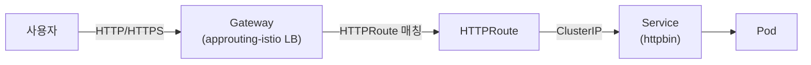

# 02 — 환경 준비

> 🟢 실행 = 직접 입력·수행 · 👁️ 예시 = 눈으로만(개념/발췌) · 📋 예상 출력 = 비교용(입력 불필요)

예상 소요 시간: 15–20분 (AKS 생성 대기 5–10분 포함)

---

<details>
<summary>🔄 0단계 — 변수 재설정 (새 터미널/세션에서 시작하는 경우)</summary>

🟢 **실행**

```bash
source ~/.approuting-ws-env
echo "RESOURCE_GROUP=$RESOURCE_GROUP"
```

</details>

---

## 1. 리소스 그룹 생성

🟢 **실행**

```bash
az group create --name $RESOURCE_GROUP --location $LOCATION -o table
```

📋 **예상 출력**

```
Location      Name
------------  -----------------------
koreacentral  rg-approuting-ws-04271
```

---

## 2. AKS 클러스터 생성 — 한 번에 전 기능 활성화

> **왜 한 번에 켜야 하나요?**
> `az aks update`는 클러스터 전체 구성을 GET한 뒤 수정된 값으로 PUT하는 방식(GET→PUT 왕복)입니다.
> 이 과정에서 이전 단계에서 설정한 플래그가 응답 페이로드에 포함되지 않으면 기본값으로 덮어씌워질 수 있습니다.
> 따라서 이 워크샵에서는 모든 애드온과 기능을 `az aks create` 한 번에 활성화합니다.

🟢 **실행**

```bash
az aks create \
  --resource-group $RESOURCE_GROUP \
  --name $CLUSTER \
  --location $LOCATION \
  --node-count 2 \
  --node-vm-size Standard_D2s_v5 \
  --enable-gateway-api \
  --enable-app-routing-istio \
  --enable-oidc-issuer \
  --enable-workload-identity \
  --enable-addons azure-keyvault-secrets-provider \
  --generate-ssh-keys
```

**플래그 설명:**

| 플래그 | 역할 | 사용 모듈 |
|--------|------|----------|
| `--enable-gateway-api` | Kubernetes Gateway API CRD(standard 채널) 설치 및 관리형 GatewayClass `approuting-istio` 구성 | 03, 04, 05 |
| `--enable-app-routing-istio` | application routing 애드온 활성화 + Istio 기반 Ingress 컨트롤러(`aks-istio-ingress` 네임스페이스) 배포 | 03, 04, 05 |
| `--enable-oidc-issuer` | 클러스터 전용 OIDC Issuer URL 발급(Workload Identity의 전제 조건) | 04 |
| `--enable-workload-identity` | Kubernetes ServiceAccount를 Azure AD Managed Identity에 연결하는 Workload Identity 활성화 | 04 |
| `--enable-addons azure-keyvault-secrets-provider` | Key Vault에서 인증서와 시크릿을 CSI 드라이버로 마운트하는 애드온 활성화 | 05 |
| `--generate-ssh-keys` | 노드 SSH 접속용 키 쌍 자동 생성(없을 경우) | — (관리 용도) |

클러스터 생성에는 **5–10분** 정도 소요됩니다. 아래 ⏳ 섹션을 읽으며 기다립니다.

---

## ⏳ 기다리는 동안 읽기

> 클러스터 생성이 완료될 때까지 다음 내용을 읽어 둡니다.

### Gateway API란 무엇인가?

Kubernetes에서 클러스터 외부의 트래픽을 내부 서비스로 라우팅하는 전통적인 방법은 **Ingress API**였습니다.
그러나 Ingress API는 몇 가지 구조적 한계를 안고 있었습니다.

- **Annotation 파편화**: NGINX, Traefik, HAProxy 등 각 Ingress 컨트롤러는 서로 다른 `nginx.ingress.kubernetes.io/...` 형태의 어노테이션을 사용합니다. 동일한 라우팅 의도를 컨트롤러마다 다른 방식으로 표현해야 하므로 이식성이 낮습니다.
- **역할 분리 부재**: 클러스터 관리자(인프라 담당)와 애플리케이션 개발자(라우팅 규칙 담당) 간의 경계가 Ingress 오브젝트 하나에 혼재합니다. 모든 권한을 가진 사람만 라우팅 규칙을 수정할 수 있거나, 반대로 개발자가 실수로 클러스터 전체 설정을 변경하는 사고가 발생할 수 있습니다.

이러한 한계를 해결하기 위해 Kubernetes SIG Network은 **Gateway API**를 설계했습니다.
Gateway API는 역할에 따라 오브젝트를 분리합니다.

| 오브젝트 | 담당 역할 | 설명 |
|---------|----------|------|
| `GatewayClass` | 클러스터 관리자 | 어떤 컨트롤러가 Gateway를 구현할지 정의 |
| `Gateway` | 인프라 운영자 | 트래픽 수신 포트·프로토콜·TLS 정책을 선언 |
| `HTTPRoute` | 애플리케이션 개발자 | 특정 Gateway에 연결할 URL 경로·헤더 기반 라우팅 규칙 정의 |

> **참고** 2026년 3월 Kubernetes에서 Ingress NGINX 컨트롤러의 공식 유지보수가 종료되었습니다.
> 커뮤니티는 Gateway API로의 전환을 권장하고 있으며, 주요 클라우드 공급자들도 Gateway API 기반 관리형 솔루션을 제공하기 시작했습니다.

### application routing 애드온의 Gateway API vs Istio 서비스 메시 애드온

이 워크샵에서는 `--enable-app-routing-istio` 플래그를 사용하지만, 두 개념을 혼동하지 않는 것이 중요합니다.

| 항목 | application routing 애드온 (Gateway API 모드) | Istio 서비스 메시 애드온 |
|------|-----------------------------------------------|------------------------|
| 목적 | 클러스터 **외부 → 내부** Ingress 트래픽 처리 | 클러스터 **내부** 서비스 간 트래픽 제어(mTLS, 트래픽 분산 등) |
| 구현 | Istio Ingress Gateway를 컨트롤러로 활용한 관리형 Gateway API | Istio 사이드카 프록시(Envoy)를 통한 서비스 메시 |
| 메시 기능 | 없음(Ingress 전용) | mTLS, 서킷 브레이커, 카나리 트래픽 분산 등 풍부한 메시 기능 제공 |
| 관리 주체 | AKS application routing 애드온이 자동 관리 | `az aks mesh enable`로 별도 활성화, 사이드카 주입 필요 |

`--enable-app-routing-istio`는 **Istio의 Ingress Gateway 구현만**을 application routing 애드온에 연결합니다.
사이드카 주입, mTLS, 트래픽 정책 등 풀 메시 기능은 포함되지 않습니다.

### Managed Gateway API CRD 설치 개념

`--enable-gateway-api` 플래그를 지정하면 AKS가 클러스터에 Gateway API CRD를 자동으로 설치하고 관리합니다.

- **standard 채널만 지원**: AKS는 Gateway API의 `standard` 릴리스 채널 CRD만 설치합니다(`experimental` 채널의 일부 리소스 유형은 포함되지 않습니다).
- **K8s 버전별 번들 버전 자동 관리**: AKS Kubernetes 버전 업그레이드 시, 해당 버전에 맞는 Gateway API CRD 번들 버전도 함께 업데이트됩니다. 수동으로 CRD를 설치하거나 버전을 관리할 필요가 없습니다.
- **GatewayClass 자동 등록**: 애드온 활성화와 함께 `approuting-istio`라는 이름의 `GatewayClass` 오브젝트가 자동으로 생성됩니다. `Gateway` 오브젝트에서 이 클래스를 참조하면 application routing 컨트롤러가 자동으로 Azure Load Balancer를 프로비저닝합니다.

다음 다이어그램은 이 워크샵에서 구성할 트래픽 흐름을 보여줍니다.

👁️ **예시**



---

## 3. 자격 증명 획득 및 검증

클러스터 생성이 완료되면 자격 증명을 가져오고 주요 구성 요소를 검증합니다.

🟢 **실행**

```bash
az aks get-credentials --resource-group $RESOURCE_GROUP --name $CLUSTER --overwrite-existing
kubectl get crds | grep gateway.networking.k8s.io
kubectl get pods -n aks-istio-system
kubectl get gatewayclass
```

📋 **예상 출력**

```
# kubectl get crds | grep gateway.networking.k8s.io
gatewayclasses.gateway.networking.k8s.io        ...
gateways.gateway.networking.k8s.io              ...
grpcroutes.gateway.networking.k8s.io            ...
httproutes.gateway.networking.k8s.io            ...
referencegrants.gateway.networking.k8s.io       ...

# kubectl get pods -n aks-istio-system
NAME                              READY   STATUS    RESTARTS   AGE
istiod-asm-1-21-xxxxxxxxx-xxxxx   1/1     Running   0          5m
istiod-asm-1-21-xxxxxxxxx-xxxxx   1/1     Running   0          5m

# kubectl get gatewayclass
NAME               CONTROLLER                                    ACCEPTED   AGE
approuting-istio   approuting.kubernetes.azure.com/gateway       True       5m
```

Gateway API CRD 5종(gatewayclasses, gateways, grpcroutes, httproutes, referencegrants)이 모두 확인되고, `istiod-*` 파드 2개가 `Running` 상태이며, `approuting-istio` GatewayClass가 `Accepted: True`로 표시되면 환경 준비가 완료된 것입니다.

---

## 트러블슈팅

| 증상 | 원인 | 해결 방법 |
|------|------|-----------|
| `az aks create` 실행 시 `--enable-app-routing-istio` unrecognized argument 오류 | az CLI 버전이 이 플래그를 지원하지 않는 구버전(2.86.0 미만) | 01 모듈의 버전 게이트(az CLI ≥ 2.86.0)를 재확인하고 `az upgrade`를 실행한 뒤 Cloud Shell 세션을 새로 엽니다 |
| `az aks create` 실패, `Operation results in exceeding quota of cores` 오류 | 구독의 `Standard_D2s_v5` vCPU 쿼터 부족 (노드 2개 × 2 vCPU = 4 vCPU 필요) | Azure Portal → 구독 → 사용량 + 할당량에서 `StandardDSv5Family` 쿼터를 확인하고 증가 요청을 제출합니다 |
| `kubectl get pods -n aks-istio-system` 결과에서 `istiod-*` 파드가 `Pending` 상태 | 노드 리소스 부족 또는 애드온 초기화 지연 | `kubectl describe pod -n aks-istio-system <pod-name>`으로 이벤트를 확인합니다. 노드 용량 문제라면 `az aks scale --resource-group $RESOURCE_GROUP --name $CLUSTER --node-count 3`으로 노드를 추가합니다 |

---

[← 01 — 사전 준비](01-prerequisites.md) | 다음: [03 — 첫 번째 Gateway 배포](03-first-gateway.md)

<!-- TODO(rehearsal): 예상 출력 실측 검증 -->
