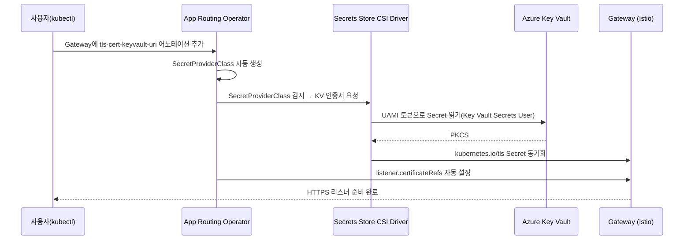

# 04 — DNS·TLS 인프라 준비

> 🟢 실행 = 직접 입력·수행 · 👁️ 예시 = 눈으로만(개념/발췌) · 📋 예상 출력 = 비교용(입력 불필요)

예상 소요 시간: 15–20분 (RBAC 전파 대기 포함)

---

<details>
<summary>🔄 0단계 — 변수 재설정 (새 터미널/세션에서 시작하는 경우)</summary>

🟢 **실행**
```bash
source ~/.approuting-ws-env
echo "RESOURCE_GROUP=$RESOURCE_GROUP  CLUSTER=$CLUSTER"
```

🟢 **실행**
```bash
az aks get-credentials --resource-group $RESOURCE_GROUP --name $CLUSTER --overwrite-existing || true
```

</details>

---

## 1. Azure DNS 퍼블릭 존 생성

이 워크샵에서는 **위임(NS 등록) 없는 가상 도메인** 전략을 사용합니다.
`$ZONE_NAME` 도메인을 공인 등록기관에 등록하지 않으므로 인터넷의 일반 리졸버에서는 조회할 수 없지만, DNS 존의 권한 네임서버에 직접 질의하면 레코드를 확인할 수 있습니다.
실제 운영 환경에서는 등록기관에서 NS 레코드를 Azure DNS의 네임서버로 위임해야 합니다.

🟢 **실행**
```bash
az network dns zone create --resource-group $RESOURCE_GROUP --name $ZONE_NAME
export ZONE_ID=$(az network dns zone show --resource-group $RESOURCE_GROUP --name $ZONE_NAME --query id -o tsv)
echo "Zone ID: $ZONE_ID"
```

---

## 2. Key Vault(RBAC 모드) 생성 및 인증서 발급 권한 부여

Application Routing 애드온은 Key Vault를 RBAC 인가 모드로만 지원합니다.
아래 명령으로 Vault를 생성하고, 현재 로그인한 사용자에게 **Key Vault Certificates Officer** 역할을 부여합니다.
이 역할은 다음 단계에서 자체 서명 인증서를 생성하는 데 필요합니다.

🟢 **실행**
```bash
az keyvault create \
  --name $KV_NAME \
  --resource-group $RESOURCE_GROUP \
  --location $LOCATION \
  --enable-rbac-authorization true

export MY_OBJECT_ID=$(az ad signed-in-user show --query id -o tsv)
az role assignment create \
  --assignee-object-id $MY_OBJECT_ID \
  --assignee-principal-type User \
  --role "Key Vault Certificates Officer" \
  --scope $(az keyvault show --name $KV_NAME --query id -o tsv)
```

> **참고** Azure RBAC 전파에는 최대 1–2분이 소요됩니다. 다음 단계에서 403 오류가 발생하면 잠시 기다린 뒤 재시도합니다.
>
> **주의(관리형 구독)** 조직의 Azure Policy(예: Microsoft 내부 MCAPS 구독의 `SFI - Disable public network access on Key Vaults`)가 Key Vault 생성·수정 시 `publicNetworkAccess`를 자동으로 `Disabled`로 되돌리는 경우가 있습니다. 이 상태에서는 다음 단계의 인증서 생성이 `ForbiddenByConnection` 오류로 실패합니다. 해결 방법은 아래 트러블슈팅 표를 참고합니다.

---

## 3. 자체 서명 와일드카드 인증서 생성

`$ZONE_NAME` 도메인에 대한 와일드카드 자체 서명 인증서를 Key Vault에 생성합니다.

`CERT_URI`에는 **버전이 없는(versionless) URI**를 저장합니다.
Application Routing operator는 이 URI를 사용해 인증서가 교체될 때마다 새 버전을 자동으로 감지하므로, 버전 번호를 URI에 포함시키지 않아야 합니다.

`sed 's|/[^/]*$||'` 표현식은 Microsoft Learn 원문 그대로이며, 패턴과 치환 값에 변수 보간이 없어 `|` 구분자가 안전하게 사용됩니다.

🟢 **실행**
```bash
cat > cert-policy.json <<EOF
{
  "issuerParameters": { "name": "Self" },
  "keyProperties": { "exportable": true, "keyType": "RSA", "keySize": 2048, "reuseKey": false },
  "secretProperties": { "contentType": "application/x-pkcs12" },
  "x509CertificateProperties": {
    "subject": "CN=*.${ZONE_NAME}",
    "subjectAlternativeNames": { "dnsNames": ["*.${ZONE_NAME}", "${ZONE_NAME}"] },
    "validityInMonths": 12,
    "keyUsage": ["digitalSignature", "keyEncipherment"]
  }
}
EOF

az keyvault certificate create \
  --vault-name $KV_NAME \
  --name $CERT_NAME \
  --policy @cert-policy.json

export CERT_URI=$(az keyvault certificate show \
  --vault-name $KV_NAME \
  --name $CERT_NAME \
  --query id -o tsv | sed 's|/[^/]*$||')
echo "Cert URI: $CERT_URI"
```

> **RBAC 전파 지연 → 403** `az keyvault certificate create` 실행 시 `ForbiddenByRbac` 오류가 발생하면 1–2분 후 동일 명령을 재시도합니다.

---

## 4. 관리형 ID(UAMI) 생성 및 역할 할당

Application Routing operator가 DNS 레코드를 쓰고 Key Vault 시크릿을 읽을 수 있도록,
User-Assigned Managed Identity(UAMI)를 생성하고 두 가지 Azure 역할을 할당합니다.

> **참고(재실행 시)** 이 모듈의 `az role assignment create`·`az identity federated-credential create`는 동일 인자로 재실행하면 `already exists` 오류를 반환할 수 있습니다. 이미 생성된 상태라는 뜻이므로 무시하고 다음 단계로 진행하면 됩니다.

- **DNS Zone Contributor** — `$ZONE_ID` 스코프: ExternalDNS가 A 레코드를 생성·삭제합니다.
- **Key Vault Secrets User** — Key Vault 스코프: CSI 드라이버가 인증서 시크릿을 읽습니다.

🟢 **실행**
```bash
az identity create --resource-group $RESOURCE_GROUP --name $UAMI_NAME --location $LOCATION
export UAMI_CLIENT_ID=$(az identity show --resource-group $RESOURCE_GROUP --name $UAMI_NAME --query clientId -o tsv)
export UAMI_PRINCIPAL_ID=$(az identity show --resource-group $RESOURCE_GROUP --name $UAMI_NAME --query principalId -o tsv)

az role assignment create \
  --assignee-object-id $UAMI_PRINCIPAL_ID \
  --assignee-principal-type ServicePrincipal \
  --role "DNS Zone Contributor" \
  --scope $ZONE_ID

az role assignment create \
  --assignee-object-id $UAMI_PRINCIPAL_ID \
  --assignee-principal-type ServicePrincipal \
  --role "Key Vault Secrets User" \
  --scope $(az keyvault show --name $KV_NAME --query id -o tsv)
```

---

## 5. Kubernetes ServiceAccount 및 Federated Identity Credential 생성

Workload Identity는 파드가 Kubernetes ServiceAccount(SA) 토큰을 Entra ID 액세스 토큰으로 교환하는 방식으로 동작합니다.
이 교환이 성립하려면 **Federated Identity Credential(FIC)** — Entra ID 측에서 "이 클러스터의 이 SA를 신뢰한다"고 선언하는 레코드 — 와 Kubernetes SA가 한 쌍으로 존재해야 합니다.

아래 명령에서 주목할 두 필드가 있습니다.

- **`annotations.azure.workload.identity/client-id`**: SA가 대리할 UAMI의 클라이언트 ID를 지정하여 SA↔UAMI를 연결합니다.
- **`labels.azure.workload.identity/use: "true"`**: Workload Identity Mutating Webhook이 이 SA를 사용하는 파드에 자동으로 토큰 볼륨과 환경 변수를 주입하도록 지시합니다.

🟢 **실행**
```bash
export OIDC_ISSUER=$(az aks show --resource-group $RESOURCE_GROUP --name $CLUSTER --query oidcIssuerProfile.issuerUrl -o tsv)

az identity federated-credential create \
  --identity-name $UAMI_NAME \
  --resource-group $RESOURCE_GROUP \
  --name approuting-ws-fic \
  --issuer $OIDC_ISSUER \
  --subject "system:serviceaccount:$APP_NAMESPACE:$SA_NAME" \
  --audiences "api://AzureADTokenExchange"

kubectl apply -n $APP_NAMESPACE -f - <<EOF
apiVersion: v1
kind: ServiceAccount
metadata:
  name: $SA_NAME
  annotations:
    azure.workload.identity/client-id: $UAMI_CLIENT_ID
  labels:
    azure.workload.identity/use: "true"
EOF
```

---

## 6. 파생 변수 저장

Task 5(05 모듈)에서 복원할 수 있도록 이 단계에서 생성한 세 변수를 환경 파일에 추가합니다.
(재실행으로 같은 줄이 중복 추가되어도 `source` 시 마지막 값이 적용되므로 동작에는 문제가 없습니다.)

🟢 **실행**
```bash
cat >> ~/.approuting-ws-env <<EOF
export ZONE_ID=$ZONE_ID
export CERT_URI=$CERT_URI
export UAMI_CLIENT_ID=$UAMI_CLIENT_ID
EOF
```

---

## ⏳ 기다리는 동안 읽기 — Workload Identity·FIC 개념과 Operator Reconcile 흐름

RBAC 전파에 최대 약 5분이 걸릴 수 있습니다. 기다리는 동안 아래 내용을 읽어보세요.

### Workload Identity와 Federated Identity Credential

Workload Identity의 핵심은 **시크릿 없는 인증**입니다.
파드는 Kubernetes API Server가 발급한 SA 토큰(OIDC JWT)을 가지고 Microsoft Entra ID에 교환을 요청합니다.
Entra ID는 FIC에 등록된 OIDC Issuer URL과 `subject`(`system:serviceaccount:<namespace>:<sa-name>`) 클레임을 검증하고, 일치하면 UAMI의 액세스 토큰을 반환합니다.
자격 증명은 클러스터 외부에 저장되지 않으며, 파드 재시작 시 자동으로 갱신됩니다.

### Application Routing Operator Reconcile 흐름

Gateway에 `kubernetes.azure.com/tls-cert-keyvault-uri` 어노테이션을 추가하면 Application Routing operator가 다음 흐름으로 TLS를 자동 구성합니다.

👁️ **예시**


operator가 Gateway 어노테이션을 감지하는 순간부터 HTTPS 리스너가 준비되기까지 모든 과정이 자동화됩니다.
다음 모듈에서 이 흐름을 직접 체험합니다.

---

## 트러블슈팅

| 증상 | 원인 | 해결 방법 |
|------|------|-----------|
| `az keyvault certificate create` 실행 시 `(Forbidden) Public network access is disabled ... ForbiddenByConnection` 오류 | 조직 Azure Policy(Modify 효과)가 Key Vault의 `publicNetworkAccess`를 자동으로 `Disabled`로 강제함 (Microsoft 내부 MCAPS 구독의 `KeyVault_PublicNetwork_Modify` 정책 등) | 정책의 제외 태그를 Vault에 부여한 뒤 공용 액세스를 다시 켭니다: `az tag update --resource-id $(az keyvault show --name $KV_NAME --query id -o tsv) --operation Merge --tags SecurityControl=Ignore` 실행 후 `az keyvault update --name $KV_NAME --public-network-access Enabled`. `az keyvault show --name $KV_NAME --query properties.publicNetworkAccess -o tsv`가 `Enabled`를 유지하는지 확인하고 인증서 생성을 재시도합니다 |
| `az keyvault certificate create` 실행 시 `ForbiddenByRbac(403)` 오류 | Key Vault Certificates Officer RBAC 전파 지연(최대 1–2분) | 1–2분 후 동일 명령을 재실행합니다. `az role assignment list --scope $(az keyvault show --name $KV_NAME --query id -o tsv) --assignee $MY_OBJECT_ID`로 역할이 반영됐는지 먼저 확인할 수 있습니다 |
| `az ad signed-in-user show` 명령이 오류를 반환하거나 값이 비어 있음 | 게스트 계정(외부 테넌트 초대 계정)으로 로그인된 경우 이 API를 사용할 수 없음 | 워크샵 테넌트의 구성원(Member) 계정으로 재로그인(`az login`)하거나, 강사에게 오브젝트 ID를 직접 받아 `MY_OBJECT_ID` 변수에 수동으로 입력합니다 |
| 05 모듈에서 TLS 인증서가 마운트되지 않거나 FIC 인증 실패 | `az identity federated-credential create` 시 `--subject` 값에 오타 (`namespace` 또는 `sa-name` 불일치) | `az identity federated-credential list --identity-name $UAMI_NAME --resource-group $RESOURCE_GROUP`로 `subject` 값을 확인하고, `kubectl get sa $SA_NAME -n $APP_NAMESPACE`의 이름과 일치하는지 비교합니다. 불일치 시 FIC를 삭제하고 재생성합니다 |

---

[← 03 — Gateway·HTTPRoute로 HTTP 노출](03-gateway-httproute.md) | 다음: [05 — TLS Gateway와 ClusterExternalDNS](05-tls-gateway-externaldns.md)
