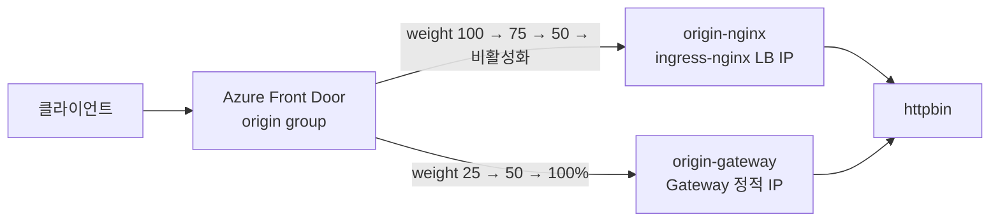

# 07 — AFD 카나리 마이그레이션 (옵션): ingress-nginx → Gateway API

> 🟢 실행 = 직접 입력·수행 · 👁️ 예시 = 눈으로만(개념/발췌) · 📋 예상 출력 = 비교용(입력 불필요)

예상 소요 시간: 50–90분 (Azure Front Door 전파 대기가 대부분 — 각 구성 변경마다 5–30분, 날에 따라 편차 큼)

> **옵션 모듈**: 이 모듈은 선택 사항입니다. 건너뛰고 바로 [08 — 정리](08-cleanup.md)로 이동해도 됩니다.

> **전제 조건**: [03](03-gateway-httproute.md)의 정적 공인 IP 고정과 [05](05-tls-gateway-externaldns.md)의 TLS Gateway 적용(HTTPRoute `hostnames`에 `httpbin.$ZONE_NAME` 포함)이 완료된 상태여야 합니다. 05를 건너뛰었다면 이 모듈의 `httpbin.$ZONE_NAME` 요청이 404를 반환합니다.

> **이 모듈에서 사용하는 Gateway API 경로**: 새 Gateway를 만들지 않고 03·05 모듈에서 구성한 Istio 기반 Application Routing Gateway API를 그대로 사용합니다. `GatewayClass`는 `approuting-istio`, Gateway는 `httpbin-gateway`, HTTPRoute는 `httpbin`입니다. AFD의 `origin-gateway`는 이 Gateway의 정적 공인 IP(`$STATIC_IP`)와 **HTTP 80 리스너**를 사용합니다. 클라이언트 HTTPS는 AFD에서 종료되므로, 05에서 구성한 Gateway의 HTTPS 443 리스너는 AFD origin 경로에 사용하지 않습니다.

기존 운영 환경이 **Azure Front Door(AFD) → ingress-nginx(application routing add-on)** 구조일 때, 무중단으로 **application routing Gateway API**로 이관하는 절차를 실습합니다. 핵심 전략은 두 가지 공식 패턴의 조합입니다.

1. **병렬 데이터 플레인**: ingress-nginx와 Gateway API 구현은 같은 클러스터에서 나란히 동작하며 각자 별도의 LB IP를 가집니다 — [공식 마이그레이션 가이드](https://learn.microsoft.com/azure/aks/app-routing-nginx-to-gateway-api-migration)
2. **AFD TLS offloading + 가중치 카나리**: 클라이언트 HTTPS는 AFD에서 종료하고 origin에는 HTTP로 전달합니다. 같은 origin group에 두 IP를 등록하고 가중치를 점진 조정해 트래픽을 이관합니다 — [AFD blue/green 배포](https://learn.microsoft.com/azure/frontdoor/blue-green-deployment)

> **배경 — 왜 마이그레이션인가**: Kubernetes SIG Network가 [Ingress NGINX 프로젝트 은퇴](https://www.kubernetes.dev/blog/2025/11/12/ingress-nginx-retirement/)(2026년 3월 유지보수 종료)를 발표했고, application routing add-on의 NGINX에 대한 Microsoft 보안 패치도 2026년 11월에 종료됩니다. AKS의 공식 후속 경로가 이 워크샵에서 사용해 온 application routing Gateway API 구현입니다.

👁️ **예시** — 이관 흐름


> **중요 — in-place IP 교체는 불가**: nginx Service의 관리형 공인 IP를 Gateway로 재할당하는 방법은 없습니다. Service 삭제 시 관리형 IP는 `Static`이어도 함께 삭제되므로, 반드시 **새 IP를 상류(AFD origin)에 추가**하는 방식으로 이관해야 합니다.

---

<details>
<summary>🔄 0단계 — 변수 재설정 (새 터미널/세션에서 시작하는 경우)</summary>

🟢 **실행**
```bash
source ~/.approuting-ws-env
az aks get-credentials --resource-group $RESOURCE_GROUP --name $CLUSTER --overwrite-existing || true
echo "STATIC_IP=$STATIC_IP  ZONE_NAME=$ZONE_NAME"
```

</details>

<details>
<summary>⚠️ 06 모듈 3절(내부 LB 전환)을 수행한 경우 — 먼저 외부 Gateway로 복원</summary>

이 모듈은 Gateway가 정적 공인 IP로 노출된 상태를 전제합니다. 06 모듈 3절을 수행했다면 아래로 복원하세요.

🟢 **실행**
```bash
kubectl patch gateway httpbin-gateway -n $APP_NAMESPACE --type merge \
  -p "{\"spec\":{\"addresses\":[{\"type\":\"IPAddress\",\"value\":\"$STATIC_IP\"}]}}"
kubectl patch gateway httpbin-gateway -n $APP_NAMESPACE --type json \
  -p '[{"op":"remove","path":"/spec/infrastructure/annotations"}]'
# 1–2분 후 외부 접근 복원 확인
sleep 90
curl -s -o /dev/null -w "%{http_code}\n" --max-time 10 http://$STATIC_IP/get -H "Host: httpbin.$ZONE_NAME"
```

</details>

---

## 1. 기존 환경 재현 — ingress-nginx 경로 구성

02 모듈의 `az aks create`는 `--enable-app-routing`(ingress-nginx)과 `--enable-app-routing-istio`(Gateway API)를 **둘 다** 활성화했으므로, 이 클러스터에는 두 데이터 플레인이 이미 병렬로 존재합니다. "기존 운영 환경"을 재현하기 위해 ingress-nginx 쪽에 `Ingress`를 만들어 같은 httpbin 백엔드를 노출합니다.

🟢 **실행**
```bash
kubectl apply -f - <<EOF
apiVersion: networking.k8s.io/v1
kind: Ingress
metadata:
  name: httpbin
  namespace: $APP_NAMESPACE
spec:
  ingressClassName: webapprouting.kubernetes.azure.com
  rules:
  - host: httpbin.$ZONE_NAME
    http:
      paths:
      - path: /get
        pathType: Prefix
        backend:
          service:
            name: httpbin
            port:
              number: 8000
EOF

# ingress-nginx 컨트롤러의 LB IP 확보 (출력이 비어 있으면 10초 후 이 두 줄을 다시 실행)
export INGRESS_NGINX_IP=$(kubectl get svc -n app-routing-system nginx -o jsonpath='{.status.loadBalancer.ingress[0].ip}')
echo "INGRESS_NGINX_IP=$INGRESS_NGINX_IP"

# 값이 확인된 뒤에만 env 파일에 저장
echo "export INGRESS_NGINX_IP=$INGRESS_NGINX_IP" >> ~/.approuting-ws-env

# 두 데이터 플레인 모두 200 응답 확인
sleep 15
curl -s -o /dev/null -w "nginx   경로: %{http_code}\n" --resolve "httpbin.$ZONE_NAME:80:$INGRESS_NGINX_IP" http://httpbin.$ZONE_NAME/get
curl -s -o /dev/null -w "gateway 경로: %{http_code}\n" --resolve "httpbin.$ZONE_NAME:80:$STATIC_IP" http://httpbin.$ZONE_NAME/get
```

📋 **예상 출력**
```
ingress.networking.k8s.io/httpbin created
INGRESS_NGINX_IP=20.196.224.94
nginx   경로: 200
gateway 경로: 200
```

같은 호스트명·같은 백엔드를 두 개의 서로 다른 LB IP가 동시에 서비스하는 상태 — 이것이 마이그레이션의 출발점입니다.

---

## 2. Azure Front Door 구성 — TLS offloading과 기존 nginx origin

"기존 환경"의 AFD를 만듭니다. profile(Standard) → endpoint → origin group → origin(nginx IP) → route 순서입니다.

AFD 기본 도메인(`*.azurefd.net`)에는 Microsoft 관리 인증서가 자동 적용됩니다. 클라이언트의 HTTPS 연결은 AFD에서 종료하고, `--forwarding-protocol HttpOnly`로 ingress-nginx와 `approuting-istio` Gateway의 HTTP 80 리스너에 전달합니다. 즉, 인증서와 TLS 처리는 엣지에 집중하고 두 Kubernetes 데이터 플레인은 동일한 HTTP origin 조건으로 비교합니다.

> **참고**: `az afd` 명령은 `cdn` 확장을 사용합니다. 처음 실행 시 확장이 자동 설치됩니다(preview 경고는 무시해도 됩니다).

> **⚠️ `--additional-latency-in-milliseconds`가 카나리의 성패를 가릅니다**: AFD는 가중치를 적용하기 **전에** 지연 시간 기준으로 origin을 먼저 선별합니다. 이 값이 작으면(예: 기본 50ms) 미세한 지연 차이만으로 한쪽 origin만 선택돼 **가중치가 무시**됩니다. 실측에서도 50ms에서는 트래픽 100%가 nginx로만 향했고, 1000ms로 올린 뒤에야 가중치대로 분배됐습니다. 카나리 목적이라면 두 origin이 항상 같은 지연 버킷에 들어가도록 충분히 큰 값을 설정하세요. ([가중치 라우팅 공식 문서](https://learn.microsoft.com/azure/frontdoor/routing-methods#weighted-traffic-routing-method))

🟢 **실행**
```bash
# 1) AFD Standard 프로필과 엔드포인트 생성
az afd profile create --profile-name afd-mig-$SUFFIX --resource-group $RESOURCE_GROUP \
  --sku Standard_AzureFrontDoor -o none
export AFD_HOST=$(az afd endpoint create --endpoint-name ep-mig-$SUFFIX \
  --profile-name afd-mig-$SUFFIX --resource-group $RESOURCE_GROUP --query hostName -o tsv)
echo "export AFD_HOST=$AFD_HOST" >> ~/.approuting-ws-env
echo "AFD_HOST=$AFD_HOST"

# 2) origin group 생성 — additional-latency 값이 카나리의 핵심 (위 설명 참고)
az afd origin-group create --origin-group-name og-migration \
  --profile-name afd-mig-$SUFFIX --resource-group $RESOURCE_GROUP \
  --probe-request-type GET --probe-protocol Http --probe-interval-in-seconds 30 --probe-path /get \
  --sample-size 4 --successful-samples-required 3 \
  --additional-latency-in-milliseconds 1000 -o none

# 3) 기존 nginx IP를 origin으로 등록 (가중치 100)
az afd origin create --origin-name origin-nginx --origin-group-name og-migration \
  --profile-name afd-mig-$SUFFIX --resource-group $RESOURCE_GROUP \
  --host-name $INGRESS_NGINX_IP --origin-host-header httpbin.$ZONE_NAME \
  --http-port 80 --priority 1 --weight 100 --enabled-state Enabled \
  --enforce-certificate-name-check false -o none

# 4) 라우트 생성 — 엔드포인트 기본 도메인으로 트래픽 수신
az afd route create --route-name route-httpbin --profile-name afd-mig-$SUFFIX \
  --resource-group $RESOURCE_GROUP --endpoint-name ep-mig-$SUFFIX \
  --origin-group og-migration --supported-protocols Http Https \
  --forwarding-protocol HttpOnly --https-redirect Enabled \
  --link-to-default-domain Enabled -o none
echo "AFD 구성 완료"
```

📋 **예상 출력**
```
AFD_HOST=ep-mig-35448-enh2hcaaf7eehpgd.b02.azurefd.net
AFD 구성 완료
```

새로 만든 AFD 엔드포인트는 전 세계 엣지로 전파되기까지 **약 10–25분** 걸립니다(실측 편차가 큽니다). 전파 전에는 AFD 기본 404 페이지가 반환됩니다.

🟢 **실행**
```bash
# 200이 나올 때까지 1분 간격으로 확인 (10–25분 소요)
for i in $(seq 1 30); do
  CODE=$(curl -s -o /dev/null -w "%{http_code}" --max-time 15 https://$AFD_HOST/get)
  echo "$(date +%H:%M:%S) $CODE"
  [ "$CODE" = "200" ] && break
  sleep 60
done
```

📋 **예상 출력**
```
16:38:51 404
16:39:48 404
...
16:47:30 200
```

> 200 도달까지 이번 실측에서는 각각 약 9분·25분이 걸렸습니다. 편차가 크므로 404가 계속 나와도 30분까지는 그대로 기다리세요.

### 2.1 TLS offloading 확인

HTTP 요청은 HTTPS로 리디렉션되고, HTTPS 요청은 AFD 관리 인증서로 처리됩니다. origin에는 `HttpOnly`로 전달되므로 httpbin 응답의 URL은 `http://`로 표시됩니다.

🟢 **실행**
```bash
# HTTP → HTTPS 리디렉션
curl -s -o /dev/null -w "HTTP: %{http_code} → %{redirect_url}\n" \
  --max-time 15 http://$AFD_HOST/get

# AFD에서 TLS 종료 후 정상 응답
curl -s -o /dev/null -w "HTTPS: %{http_code}\n" \
  --max-time 15 https://$AFD_HOST/get

# AFD 기본 도메인의 Microsoft 관리 인증서 확인
echo | openssl s_client -connect $AFD_HOST:443 -servername $AFD_HOST 2>/dev/null \
  | openssl x509 -noout -subject -issuer

# origin에는 HTTP로 전달되는지 확인
curl -s --max-time 15 https://$AFD_HOST/get | grep '"url"'
```

📋 **예상 출력**
```
HTTP: 307 → https://ep-mig-35448-enh2hcaaf7eehpgd.b02.azurefd.net/get
HTTPS: 200
subject=C = US, ST = WA, L = Redmond, O = Microsoft Corporation, CN = *.azurefd.net
issuer=C = US, O = Microsoft Corporation, CN = Microsoft TLS G2 ECC CA OCSP 02
  "url": "http://ep-mig-35448-enh2hcaaf7eehpgd.b02.azurefd.net/get"
```

이제 클라이언트 트래픽이 **AFD → origin-nginx(ingress-nginx) → httpbin** 경로로 흐릅니다. 기존 운영 환경이 완성됐습니다.

---

## 3. 응답 데이터 플레인 구분 방법

카나리 비율을 관측하려면 응답이 어느 데이터 플레인을 거쳤는지 알아야 합니다. httpbin의 `/get`은 수신한 요청 헤더를 그대로 응답 본문에 보여주는데, 두 프록시는 서로 다른 헤더를 추가합니다.

🟢 **실행**
```bash
# nginx 경로 — X-Real-Ip 헤더가 존재
curl -s --resolve "httpbin.$ZONE_NAME:80:$INGRESS_NGINX_IP" http://httpbin.$ZONE_NAME/get | grep -o '"X-Real-Ip"'
# gateway 경로 — Envoy 고유 헤더가 존재
curl -s --resolve "httpbin.$ZONE_NAME:80:$STATIC_IP" http://httpbin.$ZONE_NAME/get | grep -o '"X-Envoy-Attempt-Count"'
```

📋 **예상 출력**
```
"X-Real-Ip"
"X-Envoy-Attempt-Count"
```

---

## 4. 카나리 1단계 — Gateway origin 추가 (75:25)

Gateway의 정적 IP를 두 번째 origin으로 추가하고, nginx 75 : gateway 25로 시작합니다.

🟢 **실행**
```bash
# 기존 nginx origin 가중치 75로 하향
az afd origin update --origin-name origin-nginx --origin-group-name og-migration \
  --profile-name afd-mig-$SUFFIX --resource-group $RESOURCE_GROUP --weight 75 -o none

# Gateway 정적 IP를 가중치 25로 추가
az afd origin create --origin-name origin-gateway --origin-group-name og-migration \
  --profile-name afd-mig-$SUFFIX --resource-group $RESOURCE_GROUP \
  --host-name $STATIC_IP --origin-host-header httpbin.$ZONE_NAME \
  --http-port 80 --priority 1 --weight 25 --enabled-state Enabled \
  --enforce-certificate-name-check false -o none

az afd origin list --origin-group-name og-migration --profile-name afd-mig-$SUFFIX \
  --resource-group $RESOURCE_GROUP \
  --query '[].{name:name,host:hostName,weight:weight,enabled:enabledState}' -o table
```

📋 **예상 출력**
```
Name            Host            Weight    Enabled
--------------  --------------  --------  ---------
origin-nginx    20.196.224.94   75        Enabled
origin-gateway  20.196.222.78   25        Enabled
```

**5–15분 전파 대기** 후 분배 비율을 측정합니다. origin 변경도 엣지 전파가 필요하며, health probe가 새 origin을 정상으로 판정(30초 간격 4샘플 중 3성공)하는 시간도 포함됩니다.

🟢 **실행**
```bash
sleep 600
# 40회 요청해 데이터 플레인별 응답 수 집계 (unknown = 404/503 등 분류 불가 응답)
NGINX=0; GW=0; UNKNOWN=0
for i in $(seq 1 40); do
  BODY=$(curl -s --max-time 10 "https://$AFD_HOST/get?q=$RANDOM$i")
  if echo "$BODY" | grep -q 'X-Envoy-Attempt-Count'; then GW=$((GW+1))
  elif echo "$BODY" | grep -q 'X-Real-Ip'; then NGINX=$((NGINX+1))
  else UNKNOWN=$((UNKNOWN+1)); fi
done
echo "nginx=$NGINX gateway=$GW unknown=$UNKNOWN"
```

📋 **예상 출력**
```
nginx=30 gateway=10 unknown=0
```

40회 중 약 10회(25%)가 Gateway로 흘렀습니다. 이 시점부터 실제 사용자 트래픽 일부가 새 데이터 플레인을 검증하고 있는 것입니다. `unknown`이 0이 아니면 AFD가 오류 페이지(404/503)를 반환한 것이므로 트러블슈팅 표를 확인하세요.

> **⚠️ `gateway=0`이 나와도 실패가 아닙니다**: AFD 구성 변경의 엣지 전파는 날에 따라 편차가 커서(실측 5분–30분+), 10분 대기 후에도 새 origin으로 트래픽이 전혀 흐르지 않을 수 있습니다. `az afd origin show --origin-name origin-gateway ... --query deploymentStatus`가 `NotStarted`면 아직 전파 전입니다. 5–10분 더 기다린 뒤 **측정 루프만** 다시 실행하세요.

> **참고**: 낮은 RPS에서는 AFD POP의 분산 특성상 가중치 비율이 정확히 지켜지지 않을 수 있습니다(공식 문서 명시). 측정 횟수를 늘리면 비율이 수렴합니다.

---

## 5. 카나리 2단계 — 50:50

문제가 없으면 가중치를 절반씩으로 조정합니다.

🟢 **실행**
```bash
az afd origin update --origin-name origin-nginx --origin-group-name og-migration \
  --profile-name afd-mig-$SUFFIX --resource-group $RESOURCE_GROUP --weight 50 -o none
az afd origin update --origin-name origin-gateway --origin-group-name og-migration \
  --profile-name afd-mig-$SUFFIX --resource-group $RESOURCE_GROUP --weight 50 -o none

# 전파 대기 후 재측정
sleep 600
NGINX=0; GW=0; UNKNOWN=0
for i in $(seq 1 60); do
  BODY=$(curl -s --max-time 10 "https://$AFD_HOST/get?q=$RANDOM$i")
  if echo "$BODY" | grep -q 'X-Envoy-Attempt-Count'; then GW=$((GW+1))
  elif echo "$BODY" | grep -q 'X-Real-Ip'; then NGINX=$((NGINX+1))
  else UNKNOWN=$((UNKNOWN+1)); fi
done
echo "nginx=$NGINX gateway=$GW unknown=$UNKNOWN"
```

📋 **예상 출력**
```
nginx=35 gateway=25 unknown=0
```

---

## 6. 컷오버 — nginx origin 비활성화 (0:100)

Gateway 경로가 충분히 검증됐으면 nginx origin을 **비활성화**합니다. 삭제하지 않고 비활성화만 하면 문제 발생 시 즉시 되돌릴 수 있습니다(롤백은 7절).

🟢 **실행**
```bash
az afd origin update --origin-name origin-nginx --origin-group-name og-migration \
  --profile-name afd-mig-$SUFFIX --resource-group $RESOURCE_GROUP \
  --enabled-state Disabled -o none

# 전파 대기 (비활성화 반영까지 10–20분 걸릴 수 있음) 후 확인
sleep 900
NGINX=0; GW=0; UNKNOWN=0
for i in $(seq 1 40); do
  BODY=$(curl -s --max-time 10 "https://$AFD_HOST/get?q=$RANDOM$i")
  if echo "$BODY" | grep -q 'X-Envoy-Attempt-Count'; then GW=$((GW+1))
  elif echo "$BODY" | grep -q 'X-Real-Ip'; then NGINX=$((NGINX+1))
  else UNKNOWN=$((UNKNOWN+1)); fi
done
echo "nginx=$NGINX gateway=$GW unknown=$UNKNOWN"
```

📋 **예상 출력**
```
nginx=0 gateway=40 unknown=0
```

트래픽 100%가 Gateway API 데이터 플레인으로 이관됐습니다.

---

## 7. 롤백 경로 (참고)

컷오버는 어느 단계에서든 **대칭적으로 되돌릴 수 있습니다**. `Ingress` 리소스를 그대로 두었기 때문에 AFD origin만 조작하면 됩니다.

👁️ **예시** — 문제 발생 시 nginx origin 재활성화
```bash
az afd origin update --origin-name origin-nginx --origin-group-name og-migration \
  --profile-name afd-mig-$SUFFIX --resource-group $RESOURCE_GROUP \
  --enabled-state Enabled --weight 100 -o none
az afd origin update --origin-name origin-gateway --origin-group-name og-migration \
  --profile-name afd-mig-$SUFFIX --resource-group $RESOURCE_GROUP \
  --enabled-state Disabled -o none
```

단, 8절에서 `NginxIngressController`를 삭제한 뒤에는 nginx 데이터 플레인 자체가 사라지므로 롤백에 add-on 재구성이 필요합니다. **롤백 가능 구간은 8절 이전까지**입니다.

---

## 8. 이전 데이터 플레인 정리

트래픽이 안정되면 ingress-nginx 데이터 플레인을 제거합니다. 순서가 중요합니다 — add-on이 기본 컨트롤러를 재생성(reconcile)하지 않도록 먼저 `--nginx None`을 설정한 뒤 `NginxIngressController` 리소스를 삭제합니다.

🟢 **실행**
```bash
# 1) add-on이 기본 nginx 컨트롤러를 더 이상 관리하지 않도록 설정
az aks approuting update --resource-group $RESOURCE_GROUP --name $CLUSTER --nginx None -o none

# 2) 남아 있는 NginxIngressController 리소스 삭제 → nginx Deployment/Service 제거
kubectl delete nginxingresscontrollers.approuting.kubernetes.azure.com --all

# 3) Ingress 리소스 삭제
kubectl delete ingress httpbin -n $APP_NAMESPACE

# 4) nginx 데이터 플레인이 사라졌고, AFD 경유 트래픽은 정상인지 최종 확인
sleep 30
kubectl get svc,deploy -n app-routing-system
curl -s -o /dev/null -w "AFD HTTPS 경유: %{http_code}\n" --max-time 15 https://$AFD_HOST/get
```

📋 **예상 출력**
```
nginxingresscontroller.approuting.kubernetes.azure.com "default" deleted
ingress.networking.k8s.io "httpbin" deleted from workshop namespace
No resources found in app-routing-system namespace.
AFD HTTPS 경유: 200
```

마이그레이션 완료 — ingress-nginx는 사라졌고, AFD는 Gateway API 데이터 플레인만 바라봅니다. AFD 리소스(`afd-mig-$SUFFIX`)는 `$RESOURCE_GROUP`에 있으므로 [08 — 정리](08-cleanup.md)의 RG 삭제로 함께 제거됩니다.

> **실 운영과의 차이**: 이 실습은 AFD 기본 도메인(`*.azurefd.net`)의 Microsoft 관리 인증서로 TLS offloading을 확인했습니다. 실 운영에서는 커스텀 도메인을 AFD에 연결하고 managed TLS 인증서를 발급한 뒤, [공식 마이그레이션 가이드](https://learn.microsoft.com/azure/aks/app-routing-nginx-to-gateway-api-migration)의 체크리스트(모든 hostname·경로 검증, 인증서 체인, 지속 부하 관측)를 컷오버 전에 수행하세요. 보안 요구사항상 origin 구간도 암호화해야 한다면 `HttpsOnly`와 유효한 origin 인증서를 사용해 end-to-end TLS로 구성합니다.

---

## 트러블슈팅

| 증상 | 원인 | 해결 방법 |
|------|------|-----------|
| 가중치를 설정해도 트래픽 100%가 한 origin으로만 감 | origin group의 `additional-latency-in-milliseconds`가 작아(기본 50ms) 지연 선별 단계에서 한 origin만 선택됨 — 가중치는 같은 지연 버킷 안에서만 적용 | `az afd origin-group update ... --additional-latency-in-milliseconds 1000`으로 상향합니다. 실측으로 확인된 동작입니다 |
| AFD 엔드포인트가 계속 404를 반환 | 신규 엔드포인트/라우트의 엣지 전파 전 (실측 10–25분 소요) | 1분 간격으로 재시도합니다. `az afd route show`에서 `deploymentStatus`가 `NotStarted`면 아직 전파 전이니 그대로 대기합니다. 30분 이상 지속되면 라우트의 `--link-to-default-domain Enabled` 여부를 확인합니다 |
| 가중치·비활성화 변경이 반영되지 않음 | AFD 구성 변경의 글로벌 전파에 5–30분 이상 소요될 수 있음 (날에 따라 편차 큼) | `az afd origin show ... --query deploymentStatus`가 `NotStarted`면 전파 전입니다. 충분히 대기 후 측정 루프만 재실행합니다. 컷오버(비활성화)는 특히 오래 걸릴 수 있습니다 |
| 측정 비율이 설정 가중치와 다름 | 낮은 RPS에서는 POP 분산 특성상 비율이 근사치로만 수렴 (공식 문서 명시) | 측정 횟수를 60회 이상으로 늘리거나, 정확한 비율 검증이 필요하면 부하 도구(hey, ab 등)로 RPS를 높입니다 |
| 새 origin 추가 직후 해당 origin으로 트래픽이 전혀 없음 | health probe 판정 전 (30초 간격 4샘플 중 3성공 필요 ≈ 2분+) 또는 전파 지연 | `kubectl logs -n $APP_NAMESPACE deploy/httpbin`에서 `Edge Health Probe` User-Agent 요청이 200으로 기록되는지 확인 후 5–15분 대기합니다 |

---

[← 06 — Gateway 인프라 커스터마이징 (옵션)](06-gateway-customizations.md) 또는 [← 05 — TLS Gateway와 DNS A 레코드](05-tls-gateway-externaldns.md) | 다음: [08 — 정리](08-cleanup.md)
