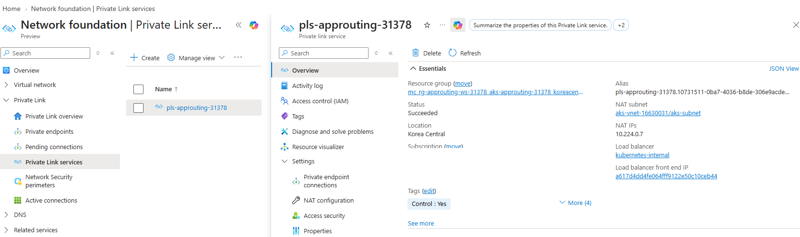

# 08 — Gateway API Private Link Service 검증 (옵션)

> 🟢 실행 = 직접 입력·수행 · 👁️ 예시 = 눈으로만(개념/발췌) · 📋 예상 출력 = 비교용(입력 불필요)

예상 소요 시간: 15–20분

> **옵션 모듈**: 이 모듈은 선택 사항입니다. [05 — TLS Gateway와 DNS A 레코드](05-tls-gateway-externaldns.md) 완료 후 진행하세요. [07 — AFD 카나리 마이그레이션 (옵션)](07-afd-canary-migration.md) 및 [09 — Istio Gateway API 쿠키 일관 해시·응답 헤더 검증 (옵션)](09-istio-cookie-affinity.md)과는 다른 경로이며, 완료 후에는 private 상태를 유지한 채 [10 — 정리](10-cleanup.md)로 이동합니다.

이 모듈은 `Gateway.spec.infrastructure.annotations`에 넣은 `azure-pls-*` 값이 Application Routing이 생성한 `Service/httpbin-gateway-approuting-istio`까지 전달되고, 그 결과 AKS 노드 리소스 그룹에 Azure Private Link Service가 생기는지 검증하는 실험입니다. 같은 managed Istio 계열의 AKS Gateway API 문서는 Gateway에 annotation을 추가해 internal load balancer 같은 LoadBalancer 설정을 커스터마이징할 수 있다고 설명하고, AKS internal LB 문서와 `cloud-provider-azure` 문서는 `azure-pls-*`가 `type: LoadBalancer` Service용 어노테이션임을 설명합니다. 즉, 여기서 확인하려는 질문은 “Gateway API가 PLS를 직접 지원하느냐”가 아니라 **“Application Routing이 Gateway annotation을 generated Service에 그대로 전달하느냐”** 입니다.

- 05 완료가 필수다.
- 07 AFD·08 PLS·09 Istio 옵션은 서로 다른 종착 경로다.
- 07 완료 후 08을 실행하면 AFD public origin이 끊기므로 이어서 실행하지 않는다.
- 08 완료 후 private 상태를 유지하고 10 정리로 이동한다.

참고: [Application Routing Gateway API](https://learn.microsoft.com/en-us/azure/aks/app-routing-gateway-api) · [Istio Gateway API customizations](https://learn.microsoft.com/en-us/azure/aks/istio-gateway-api) · [AKS internal LB + Private Link Service](https://learn.microsoft.com/en-us/azure/aks/internal-lb#connect-azure-private-link-service-to-an-aks-internal-load-balancer) · [cloud-provider-azure PLS annotations](https://cloud-provider-azure.sigs.k8s.io/topics/pls-integration/)

---

<details>
<summary>🔄 0단계 — 변수 재설정 (새 터미널/세션에서 시작하는 경우)</summary>

🟢 **실행**
```bash
source ~/.approuting-ws-env
az aks get-credentials --resource-group $RESOURCE_GROUP --name $CLUSTER --overwrite-existing || true
export NODE_RG=$(az aks show -g $RESOURCE_GROUP -n $CLUSTER --query nodeResourceGroup -o tsv)
echo "RESOURCE_GROUP=$RESOURCE_GROUP  CLUSTER=$CLUSTER  APP_NAMESPACE=$APP_NAMESPACE"
echo "LOCATION=$LOCATION  ZONE_NAME=$ZONE_NAME  SUFFIX=$SUFFIX"
echo "NODE_RG=$NODE_RG"
```

</details>

---

## 1. 사전 점검 — PLS 가능한 AKS/LB 조합인지 먼저 확인

AKS 공식 문서는 Private Link Service가 **Standard Load Balancer + `nodeIPConfiguration` backend pool** 조합에서만 지원된다고 안내합니다. 조건이 다르면 뒤 단계에서 Gateway를 바꿔도 PLS가 생성되지 않으므로, mutation 전에 fail-fast로 확인합니다.

🟢 **실행**
```bash
export NODE_RG=$(az aks show -g $RESOURCE_GROUP -n $CLUSTER --query nodeResourceGroup -o tsv)
LB_SKU=$(az aks show -g $RESOURCE_GROUP -n $CLUSTER --query networkProfile.loadBalancerSku -o tsv)
BACKEND_POOL=$(az aks show -g $RESOURCE_GROUP -n $CLUSTER --query networkProfile.loadBalancerProfile.backendPoolType -o tsv)
echo "LB_SKU=$LB_SKU  BACKEND_POOL=$BACKEND_POOL  NODE_RG=$NODE_RG"
[ "$LB_SKU" = "standard" ] || { echo "Standard Load Balancer가 필요합니다."; exit 1; }
[ "$BACKEND_POOL" = "nodeIPConfiguration" ] || { echo "nodeIPConfiguration backend pool이 필요합니다."; exit 1; }
kubectl wait --for=condition=Programmed gateway/httpbin-gateway -n $APP_NAMESPACE --timeout=120s
kubectl get httproute httpbin -n $APP_NAMESPACE -o jsonpath='{.spec.hostnames}'; echo
```

📋 **예상 출력**
```text
LB_SKU=standard  BACKEND_POOL=nodeIPConfiguration  NODE_RG=MC_rg-approuting-ws-35448_aks-approuting-ws-35448_koreacentral
["httpbin.ws35448.approuting-workshop.example","httpbin.example.com"]
```

첫 줄은 PLS 지원 조건 충족 여부이고, 둘째 줄은 05 모듈에서 추가한 `httpbin.$ZONE_NAME` 호스트명이 아직 `HTTPRoute/httpbin`에 남아 있는지 확인하는 용도입니다.

---

## 2. Gateway를 내부 LB + PLS 후보로 한 번에 전환

이번 patch는 03 모듈의 public frontend binding(`spec.addresses`)을 제거하면서, `infrastructure.annotations`에 internal LB와 PLS 생성 어노테이션을 **같은 patch**로 넣습니다. JSON merge patch는 명시하지 않은 필드를 건드리지 않으므로 기존 HTTP/HTTPS 리스너와 06 모듈의 선택적 `parametersRef`가 그대로 유지됩니다.

🟢 **실행**
```bash
export PLS_NAME=pls-approuting-$SUFFIX
kubectl patch gateway httpbin-gateway -n $APP_NAMESPACE --type merge -p "{
  \"spec\": {
    \"addresses\": null,
    \"infrastructure\": {
      \"annotations\": {
        \"service.beta.kubernetes.io/azure-load-balancer-internal\": \"true\",
        \"service.beta.kubernetes.io/azure-pls-create\": \"true\",
        \"service.beta.kubernetes.io/azure-pls-name\": \"$PLS_NAME\"
      }
    }
  }
}"
```

📋 **예상 출력**
```text
gateway.gateway.networking.k8s.io/httpbin-gateway patched
```

👁️ **예시** — patch 후 Gateway 전체 YAML 형태 (06 모듈을 수행하지 않았다면 `parametersRef` 블록만 없음)
```yaml
apiVersion: gateway.networking.k8s.io/v1
kind: Gateway
metadata:
  name: httpbin-gateway
  namespace: ${APP_NAMESPACE}
spec:
  gatewayClassName: approuting-istio
  infrastructure:
    annotations:
      service.beta.kubernetes.io/azure-load-balancer-internal: "true"
      service.beta.kubernetes.io/azure-pls-create: "true"
      service.beta.kubernetes.io/azure-pls-name: pls-approuting-${SUFFIX}
    parametersRef:
      group: ""
      kind: ConfigMap
      name: gw-options
  listeners:
  - name: http
    port: 80
    protocol: HTTP
    allowedRoutes:
      namespaces:
        from: Same
  - name: https
    hostname: httpbin.${ZONE_NAME}
    port: 443
    protocol: HTTPS
    tls:
      mode: Terminate
      options:
        kubernetes.azure.com/tls-cert-keyvault-uri: ${CERT_URI}
        kubernetes.azure.com/tls-cert-service-account: ${SA_NAME}
    allowedRoutes:
      namespaces:
        from: Same
```

핵심은 **HTTPS 443 리스너와 TLS 설정을 깨지 않고**, `Service` 쪽으로 전달될 infrastructure annotations만 덧붙인다는 점입니다. 06 모듈의 HPA/Deployment 커스터마이징을 이미 적용했다면 `parametersRef`도 그대로 남아 있어야 합니다.

---

## 3. Service 어노테이션 전달과 PLS 리소스 생성 여부 확인

Application Routing은 Gateway를 보고 `httpbin-gateway-approuting-istio` Service를 다시 reconcile합니다. 이 절에서는 다음 세 가지를 제어면(control plane) 증거로 확인합니다.

1. Gateway 주소가 공인 IP에서 사설 IP로 바뀌는가
2. generated Service에 `azure-load-balancer-internal`/`azure-pls-*` 어노테이션이 보이는가
3. AKS 노드 리소스 그룹 `$NODE_RG`에 PLS alias가 생성되는가

🟢 **실행**
```bash
for i in $(seq 1 30); do
  GW_IP=$(kubectl get gateway httpbin-gateway -n $APP_NAMESPACE -o jsonpath='{.status.addresses[0].value}' 2>/dev/null)
  [[ "$GW_IP" == 10.* || "$GW_IP" == 172.1[6-9].* || "$GW_IP" == 172.2[0-9].* || "$GW_IP" == 172.3[0-1].* || "$GW_IP" == 192.168.* ]] && break
  echo "private Gateway IP 대기 중..."; sleep 10
done
echo "GW_IP=$GW_IP"
kubectl get gateway httpbin-gateway -n $APP_NAMESPACE
kubectl get svc httpbin-gateway-approuting-istio -n $APP_NAMESPACE -o json \
  | jq '.metadata.annotations | with_entries(select(.key | contains("azure-pls") or contains("azure-load-balancer-internal")))'
az network private-link-service show -g $NODE_RG -n $PLS_NAME \
  --query '{name:name,state:provisioningState,alias:alias}' -o table
export PLS_ID=$(az network private-link-service show -g $NODE_RG -n $PLS_NAME --query id -o tsv)
echo "PLS_ID=$PLS_ID"
```

`jq` 출력은 Service 전체가 아니라 이번 검증과 관련된 annotation만 남긴 것입니다.

📋 **예상 출력**
```text
GW_IP=10.224.0.9
NAME              CLASS              ADDRESS     PROGRAMMED   AGE
httpbin-gateway   approuting-istio   10.224.0.9  True         96m
{
  "service.beta.kubernetes.io/azure-load-balancer-internal": "true",
  "service.beta.kubernetes.io/azure-pls-create": "true",
  "service.beta.kubernetes.io/azure-pls-name": "pls-approuting-35448"
}
Name                 State      Alias
-------------------  ---------  -------------------------------------------------------------------------------
pls-approuting-35448 Succeeded  pls-approuting-35448.01234567-89ab-cdef-0123-456789abcdef.koreacentral.azure.privatelinkservice
PLS_ID=/subscriptions/.../resourceGroups/MC_.../providers/Microsoft.Network/privateLinkServices/pls-approuting-35448
```

> **주의 — 아직 종단간 성공을 선언하지 않습니다.** 위 출력은 “Gateway → generated Service → node RG의 PLS 리소스”까지의 제어면 증거입니다. `azure-pls-*`가 실제 데이터 경로까지 통과하는지는 다음 절의 Private Endpoint/ACI 경로를 **리허설에서** 검증한 뒤 확정합니다.

PLS 생성 결과는 Azure Portal에서도 확인할 수 있습니다. **Network foundation → Private Link services → `pls-approuting-$SUFFIX` → Overview**로 이동해 Status가 `Succeeded`이고 NAT subnet·NAT IP·연결된 Load balancer가 표시되는지 확인합니다.



---

## 4. 소비자 VNet, Private Endpoint, ACI로 private data path 확인

이 절은 다른 VNet의 소비자 관점에서 PLS에 접속하는 절차입니다. `snet-pe`에는 Private Endpoint를, `snet-aci`에는 ACI를 배치합니다. ACI 요청에도 `Host: httpbin.$ZONE_NAME` 헤더를 넣어 05 모듈의 HTTPRoute host match 조건을 그대로 통과시킵니다.

### 4.1 소비자 VNet과 Private Endpoint 준비

🟢 **실행**
```bash
export CONSUMER_VNET=vnet-pls-consumer-$SUFFIX
export PE_NAME=pe-approuting-$SUFFIX

az network vnet create -g $RESOURCE_GROUP -n $CONSUMER_VNET -l $LOCATION \
  --address-prefixes 10.250.0.0/16 \
  --subnet-name snet-pe --subnet-prefixes 10.250.1.0/24 -o none
az network vnet subnet update -g $RESOURCE_GROUP --vnet-name $CONSUMER_VNET -n snet-pe \
  --disable-private-endpoint-network-policies true -o none
az network vnet subnet create -g $RESOURCE_GROUP --vnet-name $CONSUMER_VNET -n snet-aci \
  --address-prefixes 10.250.2.0/24 \
  --delegations Microsoft.ContainerInstance/containerGroups -o none

az network private-endpoint show -g $RESOURCE_GROUP -n $PE_NAME >/dev/null 2>&1 || \
az network private-endpoint create -g $RESOURCE_GROUP -n $PE_NAME -l $LOCATION \
  --vnet-name $CONSUMER_VNET --subnet snet-pe \
  --private-connection-resource-id $PLS_ID \
  --connection-name ${PE_NAME}-conn -o none

for i in $(seq 1 30); do
  PE_STATE=$(az network private-endpoint show -g $RESOURCE_GROUP -n $PE_NAME \
    --query 'privateLinkServiceConnections[0].privateLinkServiceConnectionState.status' -o tsv 2>/dev/null)
  echo "PE_STATE=$PE_STATE"
  [ "$PE_STATE" = "Approved" ] && break
  sleep 10
done

PE_NIC_ID=$(az network private-endpoint show -g $RESOURCE_GROUP -n $PE_NAME --query 'networkInterfaces[0].id' -o tsv)
export PE_IP=$(az network nic show --ids $PE_NIC_ID --query 'ipConfigurations[0].privateIPAddress' -o tsv)
echo "PE_IP=$PE_IP"
```

📋 **예상 출력**
```text
PE_STATE=Pending
PE_STATE=Approved
PE_IP=10.250.1.4
```

Private Endpoint와 소비자 VNet은 `$RESOURCE_GROUP`에 생기고, 연결 대상인 PLS는 `$NODE_RG`에 남습니다. 그래서 10 모듈의 RG 삭제로 소비자 쪽 리소스가 지워지고, AKS 삭제로 PLS와 internal LB가 함께 정리됩니다.

### 4.2 ACI에서 Private Endpoint 경유 요청 실행

ACI는 VNet 내부에서만 통신하므로 `--ip-address Private`를 사용합니다. 컨테이너는 `curlimages/curl:8.10.1` 단일 이미지로 한 번 실행되고 종료되며, 마지막 판정은 `az container logs`로만 확인합니다.

> **참고** `--os-type Linux --cpu 1 --memory 1`은 필수입니다. az CLI는 `osType`을 자동 추론하지 않으며, 리소스 요청(CPU/메모리)도 API 버전 `2017-07-01-preview` 이후 항상 명시해야 합니다. 생략하면 각각 `InvalidOsType`, `ResourceRequestsNotSpecified` 오류로 실패합니다.

🟢 **실행**
```bash
export ACI_NAME=aci-pls-test-$SUFFIX

az container delete -g $RESOURCE_GROUP -n $ACI_NAME --yes 2>/dev/null || true
while az container show -g $RESOURCE_GROUP -n $ACI_NAME >/dev/null 2>&1; do
  echo "기존 ACI 삭제 대기 중..."; sleep 10
done

az container create -g $RESOURCE_GROUP -n $ACI_NAME -l $LOCATION \
  --image curlimages/curl:8.10.1 \
  --os-type Linux --cpu 1 --memory 1 \
  --restart-policy Never \
  --ip-address Private \
  --vnet $CONSUMER_VNET --subnet snet-aci \
  --command-line "sh -c 'curl -sS --fail --max-time 20 -o /tmp/body -w \"HTTP_CODE=%{http_code}\n\" -H \"Host: httpbin.$ZONE_NAME\" http://$PE_IP/get && cat /tmp/body'" \
  -o none

for i in $(seq 1 30); do
  ACI_STATE=$(az container show -g $RESOURCE_GROUP -n $ACI_NAME --query 'containers[0].instanceView.currentState.state' -o tsv 2>/dev/null)
  echo "ACI_STATE=$ACI_STATE"
  [ "$ACI_STATE" = "Terminated" ] && break
  [ "$ACI_STATE" = "Succeeded" ] && break
  [ "$ACI_STATE" = "Failed" ] && break
  sleep 10
done

az container logs -g $RESOURCE_GROUP -n $ACI_NAME
```

아래는 **live rehearsal로 검증한 실측 출력**입니다. 판정 기준은 `HTTP_CODE=200`과 httpbin JSON body가 함께 보이는지입니다.

📋 **예상 출력**
```text
HTTP_CODE=200
{
  "args": {},
  "headers": {
    "Accept": ["*/*"],
    "Host": ["httpbin.ws35448.approuting-workshop.example"],
    "User-Agent": ["curl/8.10.1"],
    "X-Envoy-Attempt-Count": ["1"],
    "X-Envoy-Decorator-Operation": ["httpbin.workshop.svc.cluster.local:8000/*"],
    "X-Envoy-External-Address": ["10.224.0.4"],
    "X-Envoy-Peer-Metadata": ["..."],
    "X-Envoy-Peer-Metadata-Id": ["router~10.244.0.29~httpbin-gateway-approuting-istio-xxxxxxxxxx-xxxxx.workshop~workshop.svc.cluster.local"],
    "X-Forwarded-For": ["10.224.0.4"],
    "X-Forwarded-Proto": ["http"],
    "X-Request-Id": ["..."]
  },
  "method": "GET",
  "origin": "10.224.0.4",
  "url": "http://httpbin.ws35448.approuting-workshop.example/get"
}
```

> **참고 — `origin`이 ACI 서브넷 IP(`10.250.2.x`)가 아니라 AKS 서브넷 대역(`10.224.0.x`)으로 보이는 이유**: Azure Private Link Service는 기본적으로 소비자(consumer) 트래픽을 PLS의 NAT IP 풀로 변환(SNAT)해 provider 쪽에 전달합니다. 원본 클라이언트 IP는 [TCP Proxy Protocol v2](https://learn.microsoft.com/en-us/azure/private-link/private-link-service-overview#getting-connection-information-using-tcp-proxy-v2)를 PLS에서 활성화해야만 보존됩니다. 이 워크샵에서는 Proxy Protocol을 켜지 않았으므로 `origin`/`X-Forwarded-For` 모두 ACI가 아닌 NAT IP(AKS 서브넷 대역)로 관측되는 것이 **정상 동작**입니다. `X-Envoy-*` 헤더는 Istio Gateway가 Envoy를 통해 요청을 프록시하면서 추가한 것으로, Gateway API 자체가 아니라 이 워크샵의 `approuting-istio` 구현(Istio Ingress Gateway)에서 비롯됩니다.

이 단계가 리허설에서도 같은 형태로 통과하면, `Private Endpoint → PLS → internal LB → Application Routing Gateway → HTTPRoute → httpbin` 경로가 실제로 동작했다는 데이터를 확보한 것입니다.

---

## 5. 개념 정리 — 이번 검증이 확인하는 범위

- `azure-pls-*`는 **Gateway API 스펙**이 아니라 `type: LoadBalancer` Service를 처리하는 **cloud-provider-azure 어노테이션**입니다.
- Application Routing의 Gateway API 구현은 `Gateway`를 기반으로 `Service`, `Deployment`, `HPA`, `PDB`를 자동 생성합니다.
- 따라서 이번 실험의 핵심 질문은 **“Gateway infrastructure annotation이 generated Service까지 그대로 전달되는가”** 입니다.
- 05 모듈의 HTTPS 443/TLS listener는 이번 검증에서 직접 사용하지 않더라도 그대로 보존합니다. 즉, 이번 patch는 private 경로 실험을 위해 public binding만 제거하고, 기존 TLS 구성을 깨지 않는 방향으로 최소 수정합니다.
- 06 모듈의 `parametersRef`를 이미 적용했다면 그것도 보존됩니다. PLS 검증과 Gateway별 HPA/Deployment 커스터마이징은 서로 다른 concern이기 때문입니다.

---

## 트러블슈팅

| 증상 | 원인 | 해결 방법 |
|------|------|-----------|
| `nodeIPConfiguration backend pool이 필요합니다.` 출력 후 중단됨 | AKS 클러스터가 PLS 비지원 조합(Basic LB 또는 다른 backend pool type)으로 만들어짐 | `az aks show -g $RESOURCE_GROUP -n $CLUSTER --query '{sku:networkProfile.loadBalancerSku,pool:networkProfile.loadBalancerProfile.backendPoolType}' -o table`로 현재 구성을 다시 확인합니다. 이 워크샵의 02 모듈처럼 Standard LB + `nodeIPConfiguration` 조합으로 다시 준비해야 합니다 |
| `kubectl patch`가 webhook denied 오류로 실패함 | Gateway patch JSON이 잘못되었거나 허용되지 않는 필드를 함께 수정하려고 함 | 명령을 그대로 다시 복사해 실행하고, patch 범위가 `spec.addresses`와 `spec.infrastructure.annotations`에만 한정되는지 확인합니다. 06 모듈의 `parametersRef`는 제거하지 않아야 합니다 |
| `jq` 출력에 `azure-pls-*` annotation이 보이지 않음 | Application Routing이 아직 generated Service를 reconcile하지 않았거나, patch가 반영되지 않았음 | `kubectl get gateway httpbin-gateway -n $APP_NAMESPACE -o yaml`로 `spec.infrastructure.annotations`가 남아 있는지 확인합니다. `kubectl get events -n $APP_NAMESPACE --sort-by=.lastTimestamp`로 LB 재구성 진행 상황을 보고 30–60초 더 기다립니다 |
| `az network private-link-service show`가 `ResourceNotFound`를 반환함 | Service annotation은 전달됐지만 Azure LB/PLS 생성이 아직 끝나지 않았거나, 클러스터 조건이 PLS 요구 사항을 충족하지 않음 | 1절의 LB SKU/backend pool 결과를 다시 확인합니다. `kubectl get svc httpbin-gateway-approuting-istio -n $APP_NAMESPACE -o yaml`에서 internal/PLS annotation이 보이면 1–2분 더 기다린 뒤 다시 조회합니다 |
| Private Endpoint 상태가 계속 `Pending`에 머묾 | 연결 승인이 아직 끝나지 않았거나, 잘못된 PLS ID를 사용했거나, `snet-pe`의 PE 네트워크 정책이 비활성화되지 않음 | `az network private-endpoint show -g $RESOURCE_GROUP -n $PE_NAME --query 'privateLinkServiceConnections[0].privateLinkServiceConnectionState' -o json`로 상세 상태를 봅니다. `az network vnet subnet show -g $RESOURCE_GROUP --vnet-name $CONSUMER_VNET -n snet-pe --query privateEndpointNetworkPolicies -o tsv`가 `Disabled`인지 확인합니다 |
| ACI가 `Provisioning failed` 또는 subnet 오류로 생성되지 않음 | `snet-aci` delegation이 없거나, 같은 이름의 기존 컨테이너 그룹이 아직 삭제 중임 | `az network vnet subnet show -g $RESOURCE_GROUP --vnet-name $CONSUMER_VNET -n snet-aci --query delegations[].serviceName -o tsv`로 `Microsoft.ContainerInstance/containerGroups` 위임을 확인합니다. 기존 `aci-pls-test-$SUFFIX`가 남아 있으면 삭제 완료 후 다시 생성합니다 |
| `az container create` 실행 시 `InvalidOsType` 또는 `ResourceRequestsNotSpecified` 오류 | az CLI가 `osType`을 자동 추론하지 않고, ACI API가 `2017-07-01-preview` 이후 CPU/메모리 요청을 항상 요구함 | 명령에 `--os-type Linux --cpu 1 --memory 1`이 포함되어 있는지 확인합니다(이 문서의 4.2절 명령에 이미 반영됨) |
| `az container logs`에서 `HTTP_CODE=200`이 보이지 않거나 curl이 non-200/timeout으로 끝남 | Private Endpoint IP는 생겼지만 data path 일부(PLS 승인, Gateway reconcile, HTTPRoute host match, backend 준비)가 아직 완료되지 않았거나 실패함 | 먼저 `echo $PE_IP`와 `kubectl get gateway httpbin-gateway -n $APP_NAMESPACE`로 사설 IP가 맞는지 확인합니다. `Host: httpbin.$ZONE_NAME` 헤더가 빠지지 않았는지 확인하고, `kubectl get httproute httpbin -n $APP_NAMESPACE -o jsonpath='{.spec.hostnames}'`에 해당 호스트가 포함되는지 다시 점검합니다 |

---

[← 06 — Gateway 인프라 커스터마이징 (옵션)](06-gateway-customizations.md) · [← 05 — TLS Gateway와 DNS A 레코드](05-tls-gateway-externaldns.md) | 다음: [10 — 정리](10-cleanup.md)
