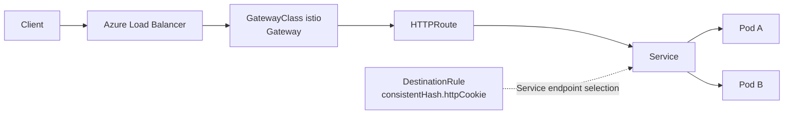

# 09 — Istio Gateway API 쿠키 일관 해시·응답 헤더 검증 (옵션)

> 🟢 실행 = 직접 입력·수행 · 👁️ 예시 = 눈으로만(개념/발췌) · 📋 예상 출력 = 비교용(입력 불필요)

예상 소요 시간: 15–20분 (2026-08-12 리허설 기준, add-on 전환과 Gateway Load Balancer 생성 대기 포함)

> **종착형 옵션 모듈**: 05 또는 06 완료 후 선택합니다. 07 AFD·08 PLS와 서로 배타적인 종착 경로이며 순차 수행하지 않습니다. 완료 후 Application Routing Gateway API로 되돌리지 않고 [10 — 정리](10-cleanup.md)로 이동합니다.

이 옵션은 `approuting-istio` GatewayClass에서 시작한 현재 ingress 경로를 AKS Istio service mesh add-on의 `istio` GatewayClass로 전환한 뒤, `DestinationRule`의 `consistentHash.httpCookie`가 **같은 쿠키에는 같은 백엔드 파드를 반복 선택하고**, **엔드포인트 구성이 바뀌면 다른 파드로 재매핑될 수 있음**을 직접 확인하는 실험입니다. 마지막에는 애플리케이션이 반환하는 **큰 응답 헤더(8/16/32 KiB)** 가 현재 AKS/Istio 조합에서 어떻게 보이는지도 기록합니다.

👁️ **예시**


`DestinationRule`은 Kubernetes Service를 대체하는 리소스가 아니라, **Istio 프록시가 해당 Service의 엔드포인트를 어떤 규칙으로 고를지**를 정의합니다. 따라서 이번 모듈의 관찰 포인트는 “Gateway API 객체를 그대로 둔 채, 데이터 평면을 `approuting-istio`에서 `istio`로 바꿨을 때 ingress Gateway가 쿠키 기반 일관 해시를 어떻게 적용하느냐”입니다.

| 비교 항목 | `approuting-istio` | `istio` | 이번 모듈에서의 의미 |
|-----------|--------------------|---------|----------------------|
| AKS add-on 성격 | application routing add-on이 관리하는 Gateway API 전용 데이터 평면 | AKS Istio service mesh add-on | `DestinationRule`을 쓰려면 `istio`로 전환해야 합니다 |
| Istio CRD | 제한적(일반적인 Istio CRD 없음) | `DestinationRule` 등 Istio CRD 지원 | 쿠키 일관 해시는 `DestinationRule`로 선언합니다 |
| 앱 파드 sidecar | 자동 주입 경로 없음 | 네임스페이스 라벨로 선택적 주입 가능 | 이번 모듈은 **앱 파드에 sidecar를 넣지 않습니다** |
| Gateway 리소스명 | `<gateway>-approuting-istio` | `<gateway>-istio` | 생성된 Gateway 프록시 이름이 바뀝니다 |

테스트 앱을 의도적으로 **uninjected(1/1)** 상태로 두는 이유도 여기에 있습니다. `DestinationRule`은 ingress Gateway의 Envoy가 해석해도 충분하며, 애플리케이션 파드에 sidecar까지 넣으면 큰 응답 헤더 관찰 결과에 두 번째 Envoy hop이 개입할 수 있습니다. 이번 실습의 응답 헤더 결과는 **ingress Gateway 경로의 관찰값**으로 읽어야 합니다.

---

<details>
<summary>🔄 0단계 — 변수 재설정 (새 터미널/세션에서 시작하는 경우)</summary>

🟢 **실행**
```bash
source ~/.approuting-ws-env
az aks get-credentials --resource-group "$RESOURCE_GROUP" --name "$CLUSTER" --overwrite-existing || true
echo "RESOURCE_GROUP=$RESOURCE_GROUP  CLUSTER=$CLUSTER  LOCATION=$LOCATION"
echo "APP_NAMESPACE=$APP_NAMESPACE"
kubectl get gatewayclass approuting-istio
kubectl get gateway httpbin-gateway -n "$APP_NAMESPACE"
kubectl get httproute httpbin -n "$APP_NAMESPACE"
export AKS_MINOR=$(az aks show -g "$RESOURCE_GROUP" -n "$CLUSTER" \
  --query kubernetesVersion -o tsv | cut -d. -f1-2)
export REVISION=$(az aks mesh get-revisions --location "$LOCATION" \
  --query "meshRevisions[?compatibleWith[?name=='KubernetesOfficial' && contains(versions, '$AKS_MINOR')]].revision | [-1]" \
  -o tsv)
export REVISION_MINOR=${REVISION##*-}
echo "AKS_MINOR=$AKS_MINOR  REVISION=$REVISION"
[ -n "$REVISION" ] && [ "$REVISION_MINOR" -ge 26 ] || {
  echo "이 AKS 버전과 호환되는 asm-1-26 이상 revision을 찾지 못했습니다."
  exit 1
}
```

</details>

---

## 1. 시작 상태 확인 — 지원되는 진입 경로만 허용

이 모듈은 **05 또는 06을 마친 직후의 상태**만 지원합니다. 즉, `httpbin-gateway`와 `HTTPRoute/httpbin`이 아직 현재 ingress 경로를 담당하고 있어야 합니다. 위 0단계 명령에서 `kubectl get gateway httpbin-gateway`가 `NotFound`라면, 이미 다른 옵션 경로로 벗어났거나 필요한 선행 모듈을 완료하지 않은 것입니다.

특히 07과 08은 현재 Gateway에 각각 **AFD public origin** 또는 **Private Link Service 상태**를 붙이는 경로이므로, 그 뒤 상태에서 이 모듈로 넘어오면 “현재 Gateway를 지우고 add-on을 바꾸는 단계”가 더 이상 안전하지 않습니다. 이 문서는 07·08 이후 상태에서 이어서 진행하는 경로를 지원하지 않습니다.

`REVISION` 조회는 Korea Central에서 현재 클러스터의 Kubernetes minor 버전과 호환되는 Istio revision 후보 중 **가장 최신 값**을 고르고, 그 값이 `asm-1-26` 이상이 아니면 파괴적 단계 전에 즉시 멈춥니다. 즉, 여기서 실패하면 이후의 Gateway 삭제나 add-on 전환을 진행하지 않습니다.

📋 **예상 출력**
```text
RESOURCE_GROUP=rg-approuting-ws-35448  CLUSTER=aks-approuting-ws-35448  LOCATION=koreacentral
APP_NAMESPACE=workshop
NAME              CONTROLLER                        ACCEPTED   AGE
approuting-istio  azure/application-routing-gateway True       1h
NAME              CLASS              ADDRESS          PROGRAMMED   AGE
httpbin-gateway   approuting-istio   20.249.51.10     True         48m
NAME      HOSTNAMES                                                  AGE
httpbin   ["httpbin.ws35448.approuting-workshop.example"]            47m
AKS_MINOR=1.33  REVISION=asm-1-27
```

여기서 `REVISION` 값은 예시입니다. 실제 실습에서는 지역과 시점에 따라 `asm-1-26`, `asm-1-27` 등으로 달라질 수 있습니다.

---

## 2. 기존 Application Routing Gateway 데이터 평면 안전하게 제거

먼저 기존 `approuting-istio` Gateway 경로를 정리합니다. 목적은 httpbin 애플리케이션 자체를 지우는 것이 아니라, **현재 ingress Gateway와 그에 종속된 자동 생성 리소스**만 제거하는 것입니다.

🟢 **실행**
```bash
kubectl delete httproute httpbin -n "$APP_NAMESPACE" --ignore-not-found
kubectl delete gateway httpbin-gateway -n "$APP_NAMESPACE" --ignore-not-found
kubectl delete configmap gw-options -n "$APP_NAMESPACE" --ignore-not-found
kubectl wait --for=delete deployment/httpbin-gateway-approuting-istio \
  -n "$APP_NAMESPACE" --timeout=300s
kubectl wait --for=delete service/httpbin-gateway-approuting-istio \
  -n "$APP_NAMESPACE" --timeout=300s
kubectl get deployment,service,hpa,pdb -n "$APP_NAMESPACE" \
  httpbin-gateway-approuting-istio 2>&1 || true
```

📋 **예상 출력**
```text
httproute.gateway.networking.k8s.io "httpbin" deleted
gateway.gateway.networking.k8s.io "httpbin-gateway" deleted
configmap "gw-options" deleted
deployment.apps/httpbin-gateway-approuting-istio condition met
service/httpbin-gateway-approuting-istio condition met
Error from server (NotFound): deployments.apps "httpbin-gateway-approuting-istio" not found
Error from server (NotFound): services "httpbin-gateway-approuting-istio" not found
Error from server (NotFound): horizontalpodautoscalers.autoscaling "httpbin-gateway-approuting-istio" not found
Error from server (NotFound): poddisruptionbudgets.policy "httpbin-gateway-approuting-istio" not found
```

핵심은 **HTTPRoute와 Gateway 삭제 후 자동 생성된 Deployment/Service/HPA/PDB가 함께 사라지는지**를 보는 것입니다. 2026-08-12 리허설에서는 Deployment보다 Service가 수십 초 늦게 사라졌으므로, Service 삭제까지 확인한 뒤에만 다음 disable 단계로 넘어갑니다. 반대로 원래의 `httpbin` 워크로드, DNS zone, Key Vault, 정적 공인 IP는 아직 리소스 그룹에 남아 있을 수 있습니다. 다만 이제 그 자원들은 **활성 ingress 경로**에 연결되어 있지 않습니다.

---

## 3. add-on 전환 — `approuting-istio` 비활성화 후 `istio` 활성화

### 3.1 Application Routing Istio만 먼저 끄기

🟢 **실행**
```bash
az aks update \
  --resource-group "$RESOURCE_GROUP" \
  --name "$CLUSTER" \
  --disable-app-routing-istio \
  -o none
az aks show -g "$RESOURCE_GROUP" -n "$CLUSTER" \
  --query 'ingressProfile.webAppRouting.gatewayApiImplementations.appRoutingIstio.mode' -o tsv
kubectl get gatewayclass
```

📋 **예상 출력**
```text
Disabled
NAME               CONTROLLER                               ACCEPTED   AGE
approuting-istio   istio.aks.azure.com/gateway-controller   True       18m
istio-remote       istio.io/unmanaged-gateway               True       18m
```

이 단계의 확인 기준은 **GatewayClass 삭제 여부가 아니라**, 2절에서 기존 generated 리소스가 사라졌고 cluster profile의 `appRoutingIstio.mode` 값이 `Disabled`로 바뀌었는지입니다. 2026-08-12 Korea Central 리허설에서는 disable 이후에도 `approuting-istio`와 `istio-remote` GatewayClass 객체가 남아 있었지만, 그 상태에서 바로 다음 절의 `az aks mesh enable`이 정상 완료되었습니다. `--disable-app-routing-istio`가 거부된다면, 아직 삭제되지 않은 기존 Gateway 리소스가 남아 있는지 먼저 다시 확인해야 합니다.

⏳ **기다리는 동안 읽기**: 다음 절의 `az aks mesh enable`은 Istio control plane과 GatewayClass 기본값을 새로 배치하므로 수 분이 걸릴 수 있습니다. 기다리는 동안 위 비교 표와 아래 쿠키 동작 설명을 먼저 읽어 두세요. 이번 실습에서 `httpCookie.ttl: 0s`는 **브라우저 종료 시 사라지는 세션 쿠키**를 의미하며, “외부 저장소에 영구 매핑을 남기는 sticky session”과는 다릅니다.

### 3.2 지원 revision 확인 후 별도 명령으로 Istio mesh enable

🟢 **실행**
```bash
az aks mesh get-revisions --location "$LOCATION" -o table
az aks mesh enable \
  --resource-group "$RESOURCE_GROUP" \
  --name "$CLUSTER" \
  --revision "$REVISION"
```

📋 **예상 출력**
```text
Revision    Upgrades            CompatibleWith      CompatibleVersions
----------  ------------------  ------------------  ----------------------------------
asm-1-28    asm-1-29, asm-1-30  KubernetesOfficial  1.30, 1.31, 1.32, 1.33, 1.34, 1.35
asm-1-29    asm-1-30            KubernetesOfficial  1.31, 1.32, 1.33, 1.34, 1.35, 1.36
asm-1-30    None available      KubernetesOfficial  1.32, 1.33, 1.34, 1.35, 1.36
```

### 3.3 설치된 revision과 GatewayClass 기본값 검증

🟢 **실행**
```bash
export INSTALLED_REVISION=$(az aks show \
  --resource-group "$RESOURCE_GROUP" \
  --name "$CLUSTER" \
  --query 'serviceMeshProfile.istio.revisions[0]' -o tsv)
echo "REQUESTED=$REVISION  INSTALLED=$INSTALLED_REVISION"
[ "$(az aks show -g "$RESOURCE_GROUP" -n "$CLUSTER" \
  --query 'serviceMeshProfile.mode' -o tsv)" = "Istio" ] || {
  echo "Istio service mesh add-on 활성화에 실패했습니다."
  exit 1
}
[ "$INSTALLED_REVISION" = "$REVISION" ] || {
  echo "요청한 Istio revision과 설치된 revision이 다릅니다."
  exit 1
}
kubectl get deployment -n aks-istio-system -l app=istiod
kubectl get pods -n aks-istio-system
kubectl get gatewayclass istio
kubectl get crd destinationrules.networking.istio.io
kubectl get configmap istio-gateway-class-defaults -n aks-istio-system \
  -o jsonpath='{.metadata.labels.gateway\.istio\.io/defaults-for-class}'; echo
```

📋 **예상 출력**
```text
REQUESTED=asm-1-30  INSTALLED=asm-1-30
NAME              READY   UP-TO-DATE   AVAILABLE   AGE
istiod-asm-1-30   1/2     2            1           13m
NAME                               READY   STATUS    RESTARTS   AGE
istiod-asm-1-30-5b7d4749fb-q5bpx   1/1     Running   0          13m
istiod-asm-1-30-5b7d4749fb-qsgl7   0/1     Pending   0          13m
NAME    CONTROLLER                  ACCEPTED   AGE
istio   istio.io/gateway-controller True       13m
NAME                                   CREATED AT
destinationrules.networking.istio.io   2026-08-12T06:10:34Z
istio
```

마지막 줄의 `istio`가 가장 중요한 확인값입니다. 2026-08-12 리허설에서는 2노드 `Standard_D2s_v5` 워크숍 클러스터에서 두 번째 `istiod`가 `Pending(Insufficient cpu)`로 남았지만, 요청한 revision 설치·`GatewayClass/istio` 수락·4절의 실제 Gateway `Programmed=True`까지는 정상적으로 확인됐습니다. 따라서 이 문서에서는 deployment 전체 `Available=True` 대신, **요청 revision 설치 + 최소 1개의 `istiod-$REVISION` 파드 `1/1 Running` + `GatewayClass/istio` 수락**을 진행 기준으로 삼습니다.

---

## 4. uninjected 테스트 앱과 Istio 라우팅 리소스 배포

이제 Tasks 1–2에서 준비해 둔 두 매니페스트를 적용합니다. 여기서 중요한 점은 **앱 네임스페이스에 injection 라벨을 남기지 않는 것**입니다. Gateway 리소스만 `${REVISION}` 라벨로 특정 revision에 고정되고, 애플리케이션 파드는 일반 Kubernetes 파드(1/1)로 유지됩니다.

🟢 **실행**
```bash
kubectl label namespace "$APP_NAMESPACE" istio.io/rev- 2>/dev/null || true
kubectl label namespace "$APP_NAMESPACE" istio-injection- 2>/dev/null || true
kubectl apply -n "$APP_NAMESPACE" -f manifests/istio-session-test-app.yaml
envsubst < manifests/istio-session-test-routing.yaml |
  kubectl apply -n "$APP_NAMESPACE" -f -
kubectl rollout status deployment/istio-session-test \
  -n "$APP_NAMESPACE" --timeout=300s
kubectl wait --for=condition=programmed gateway/istio-session-gateway \
  -n "$APP_NAMESPACE" --timeout=300s
kubectl get pods -n "$APP_NAMESPACE" -l app=istio-session-test
kubectl get gateway,httproute,destinationrule -n "$APP_NAMESPACE"
```

📋 **예상 출력**
```text
namespace/workshop not labeled
namespace/workshop not labeled
configmap/istio-session-test created
deployment.apps/istio-session-test created
service/istio-session-test created
gateway.gateway.networking.k8s.io/istio-session-gateway created
httproute.gateway.networking.k8s.io/istio-session-test created
destinationrule.networking.istio.io/istio-session-test created
deployment "istio-session-test" successfully rolled out
gateway.gateway.networking.k8s.io/istio-session-gateway condition met
NAME                                  READY   STATUS    RESTARTS   AGE
istio-session-test-7d6f8d8458-9jpzm   1/1     Running   0          34s
istio-session-test-7d6f8d8458-v6l8n   1/1     Running   0          34s
NAME                                             CLASS   ADDRESS        PROGRAMMED   AGE
gateway.gateway.networking.k8s.io/istio-session-gateway   istio   20.249.51.44   True         31s
NAME                                                 HOSTNAMES   AGE
httproute.gateway.networking.k8s.io/istio-session-test                31s
NAME                                               HOST                AGE
destinationrule.networking.istio.io/istio-session-test   istio-session-test   31s
```

파드 READY가 `1/1` 인 것이 정상입니다. 이 실습에서는 `DestinationRule`을 **Istio Gateway 프록시가 해석하는 것만으로 충분**하며, 애플리케이션에 sidecar를 넣지 않기 때문에 큰 응답 헤더 결과도 ingress Gateway 경로의 영향만 관찰할 수 있습니다. 생성되는 Gateway 프록시 리소스 이름은 `istio-session-gateway-istio` 형태입니다.

라우팅 조건과 공인 주소도 이어서 확인합니다.

🟢 **실행**
```bash
kubectl get httproute istio-session-test -n "$APP_NAMESPACE" \
  -o jsonpath='{range .status.parents[0].conditions[*]}{.type}={.status}{"\n"}{end}'
export ISTIO_GATEWAY_IP=$(kubectl get gateway istio-session-gateway \
  -n "$APP_NAMESPACE" -o jsonpath='{.status.addresses[0].value}')
echo "ISTIO_GATEWAY_IP=$ISTIO_GATEWAY_IP"
```

📋 **예상 출력**
```text
Accepted=True
ResolvedRefs=True
ISTIO_GATEWAY_IP=20.249.51.44
```

`Accepted=True`와 `ResolvedRefs=True`가 둘 다 보여야 다음 단계로 진행합니다.

---

## 5. 첫 응답에서 쿠키 발급, 같은 세션에서 파드 반복 선택 확인

첫 요청은 `Set-Cookie: workshop-session=...` 발급 여부를 보고, 이후 다섯 번의 재요청이 모두 같은 파드를 가리키는지 확인합니다.

🟢 **실행**
```bash
export COOKIE_JAR=$(mktemp)
export RESPONSE_HEADERS=$(mktemp)
export RESPONSE_BODY=$(mktemp)
curl -sS -D "$RESPONSE_HEADERS" -c "$COOKIE_JAR" \
  "http://$ISTIO_GATEWAY_IP/identity" -o "$RESPONSE_BODY"
grep -i '^set-cookie: workshop-session=' "$RESPONSE_HEADERS"
cat "$RESPONSE_BODY"; echo
for i in $(seq 1 5); do
  curl -sS -b "$COOKIE_JAR" "http://$ISTIO_GATEWAY_IP/identity" |
    jq -r .pod
done
```

📋 **예상 출력**
```text
set-cookie: workshop-session="7f6d9f84.1d8f0e3b7f8a9c1d"; Path=/
{"pod":"istio-session-test-7d6f8d8458-9jpzm"}
istio-session-test-7d6f8d8458-9jpzm
istio-session-test-7d6f8d8458-9jpzm
istio-session-test-7d6f8d8458-9jpzm
istio-session-test-7d6f8d8458-9jpzm
istio-session-test-7d6f8d8458-9jpzm
```

여기서 `ttl: 0s`는 만료 시각을 고정하지 않는 **세션 쿠키**라는 뜻입니다. 같은 cookie jar를 계속 쓰는 동안에는 같은 파드가 반복 선택되지만, 브라우저를 닫거나 jar를 버리면 새로운 세션으로 다시 분산될 수 있습니다.

---

## 6. 독립 세션 분산과 장애 후 재매핑 확인

### 6.1 서로 다른 쿠키 세션 20개로 분산 확인

이번에는 각 요청이 서로 다른 cookie jar를 갖도록 하여 분산 결과를 봅니다. 두 파드가 모두 준비되어 있다면 표본 20개 안에서 보통 둘 다 관측됩니다.

🟢 **실행**
```bash
export COOKIE_DIR=$(mktemp -d)
for i in $(seq 1 20); do
  curl -sS -c "$COOKIE_DIR/session-$i.txt" \
    "http://$ISTIO_GATEWAY_IP/identity" |
    jq -r .pod
done | sort | uniq -c
```

📋 **예상 출력**
```text
      9 istio-session-test-7d6f8d8458-9jpzm
     11 istio-session-test-7d6f8d8458-v6l8n
```

분산은 확률적입니다. 운이 나쁘면 20개 표본에서도 한 파드만 보일 수 있으므로, 그런 경우에는 먼저 **준비된 엔드포인트가 실제로 2개인지** 확인하고 새 jar 20개로 한 번 더 반복합니다.

🟢 **실행**
```bash
kubectl get endpointslice -n "$APP_NAMESPACE" \
  -l kubernetes.io/service-name=istio-session-test
```

### 6.2 처음 선택된 sticky 파드를 지운 뒤 같은 쿠키가 다른 파드로 재매핑되는지 확인

🟢 **실행**
```bash
export STICKY_POD=$(curl -sS -b "$COOKIE_JAR" \
  "http://$ISTIO_GATEWAY_IP/identity" | jq -r .pod)
kubectl delete pod "$STICKY_POD" -n "$APP_NAMESPACE"
kubectl rollout status deployment/istio-session-test \
  -n "$APP_NAMESPACE" --timeout=300s
export REMAPPED_POD=$(curl -sS -b "$COOKIE_JAR" \
  "http://$ISTIO_GATEWAY_IP/identity" | jq -r .pod)
echo "before=$STICKY_POD  after=$REMAPPED_POD"
[ "$STICKY_POD" != "$REMAPPED_POD" ]
```

📋 **예상 출력**
```text
pod "istio-session-test-7d6f8d8458-9jpzm" deleted
deployment "istio-session-test" successfully rolled out
before=istio-session-test-7d6f8d8458-9jpzm  after=istio-session-test-7f84c7d7bf-wm9qv
```

이 재매핑이 이번 실험의 핵심 차이입니다. 즉, 이 방식은 “한 번 정해진 세션이 절대 바뀌지 않는 외부 저장소형 매핑”이 아니라, **현재 엔드포인트 집합에 대한 consistent hash** 입니다. 따라서 파드가 사라지거나 새 파드로 교체되면 같은 쿠키라도 다른 대상이 선택될 수 있습니다.

---

## 7. 8/16/32 KiB 큰 응답 헤더 관찰

이 테스트는 요청 본문이 아니라 **응답 헤더 크기**를 관찰하는 실험입니다. 앱은 `X-Workshop-Large-Header`에 지정한 크기만큼 값을 채우고, 우리는 HTTP 상태 코드와 실제 헤더 바이트 길이만 요약해서 기록합니다.

🟢 **실행**
```bash
for SIZE in 8 16 32; do
  HEADER_FILE=$(mktemp)
  BODY_FILE=$(mktemp)
  HTTP_CODE=$(curl -sS --max-time 15 \
    -D "$HEADER_FILE" \
    -o "$BODY_FILE" \
    -w '%{http_code}' \
    "http://$ISTIO_GATEWAY_IP/headers?size=$SIZE")
  HEADER_BYTES=$(LC_ALL=C awk '
    BEGIN { IGNORECASE=1 }
    /^X-Workshop-Large-Header:/ {
      sub(/\r$/, "")
      sub(/^[^:]*: /, "")
      print length($0)
    }' "$HEADER_FILE")
  POD=$(LC_ALL=C awk '
    BEGIN { IGNORECASE=1 }
    /^X-Workshop-Pod:/ {
      sub(/\r$/, "")
      sub(/^[^:]*: /, "")
      print
    }' "$HEADER_FILE")
  printf '%s KiB: status=%s header_bytes=%s pod=%s\n' \
    "$SIZE" "$HTTP_CODE" "$HEADER_BYTES" "$POD"
  rm -f "$HEADER_FILE" "$BODY_FILE"
done
rm -f "$COOKIE_JAR" "$RESPONSE_HEADERS" "$RESPONSE_BODY"
rm -rf "$COOKIE_DIR"
```

📋 **예상 출력**
```text
8 KiB: status=200 header_bytes=8192 pod=istio-session-test-8649fc85c6-dg828
16 KiB: status=200 header_bytes=16384 pod=istio-session-test-8649fc85c6-dg828
32 KiB: status=200 header_bytes=32768 pod=istio-session-test-8649fc85c6-dg828
```

위 세 줄은 **2026-08-12 Korea Central 리허설에서 관찰한 실제 요약값**입니다. 실제 실습에서 16 KiB 또는 32 KiB가 다른 상태 코드로 보이면, 이번 문서의 목적은 값을 억지로 성공시키는 것이 아니라 **관측된 상태 코드와 바이트 길이를 그대로 기록하는 것**입니다. Envoy 설정을 바꿔 결과를 맞추지 말고, 현재 AKS/Istio 버전에서 어떤 값이 관찰됐는지 남기세요.

---

## 8. 결과 해석과 정리 방향

| 질문 | 기록할 결과 |
|------|-------------------|
| `DestinationRule`이 NGINX cookie affinity를 그대로 대체할 수 있는가? | 쿠키 키 기반의 일관 라우팅은 가능하지만, 완전히 동일한 영속 sticky semantics는 아닙니다 |
| Envoy에서 NGINX의 세 가지 affinity annotation이 필요한가? | Istio에는 해당 annotation 개념이 없으므로, 실제 응답 헤더 크기와 쿠키 동작을 직접 관찰해야 합니다 |
| 엔드포인트가 바뀌면 어떤 일이 일어나는가? | 같은 쿠키라도 hash ring 멤버십 변화 때문에 다른 파드로 재매핑될 수 있습니다 |
| 32 KiB 성공이 무제한 헤더 처리를 뜻하는가? | 아닙니다. 리허설한 AKS/Istio 버전에서 그 크기까지 관찰됐다는 뜻만 제공합니다 |

이 모듈은 Application Routing의 `approuting-istio` 경로와 Istio `DestinationRule` 기반 경로가 **겉으로는 비슷해 보여도 세션 의미론과 운영 포인트가 다르다**는 점을 보여 줍니다. 또한 응답 헤더 크기 결과도 “이 버전에서 이렇게 보였다”는 관찰값이지, 영구 보장 사양이 아닙니다.

완료 후에는 Application Routing Gateway API로 되돌리지 말고 바로 [10 — 정리](10-cleanup.md)로 이동합니다. 07 AFD와 08 PLS는 현재 Gateway를 다시 바꾸는 다른 종착형 경로이므로, 이 모듈 뒤에 이어서 수행하지 않습니다.

---

## 트러블슈팅

| 증상 | 원인 | 진단 | 조치 |
|------|------|------|------|
| `az aks update --disable-app-routing-istio`가 기존 Gateway가 남아 있다고 거부됨 | `httpbin-gateway` 또는 `HTTPRoute/httpbin`이 아직 삭제되지 않음 | `kubectl get gateway,httproute -n $APP_NAMESPACE`로 남아 있는 객체를 확인합니다 | 2절 명령을 다시 실행해 기존 Gateway와 HTTPRoute를 먼저 제거한 뒤 add-on disable을 재시도합니다 |
| `az aks mesh enable`이 conflict 또는 이미 다른 add-on이 활성화됐다고 실패함 | Application Routing Istio disable이 아직 cluster profile에 반영되지 않았거나 기존 generated Service 삭제가 끝나지 않음 | `az aks show -g $RESOURCE_GROUP -n $CLUSTER --query 'ingressProfile.webAppRouting.gatewayApiImplementations.appRoutingIstio.mode' -o tsv`와 `kubectl get svc httpbin-gateway-approuting-istio -n $APP_NAMESPACE`로 현재 상태를 확인합니다 | `appRoutingIstio.mode`가 `Disabled`이고 generated Service가 사라질 때까지 기다린 뒤 별도 명령으로 다시 `az aks mesh enable`을 실행합니다 |
| `istiod` Deployment가 `1/2 Available`이거나 `kubectl get pods -n aks-istio-system`에 `Pending`이 남음 | 2노드 `Standard_D2s_v5` 워크숍 클러스터의 남는 CPU가 부족해 두 번째 control plane replica가 스케줄되지 않음 | `kubectl get deployment -n aks-istio-system -l app=istiod`, `kubectl get pods -n aks-istio-system`, `kubectl get events -n aks-istio-system --sort-by=.lastTimestamp \| tail -20`로 `Insufficient cpu`를 확인합니다 | 요청한 revision이 설치되었고 최소 1개의 `istiod-$REVISION` 파드가 `1/1 Running`, `GatewayClass/istio`가 `Accepted=True`이면 4절로 진행합니다. 이후 `Gateway/istio-session-gateway`가 `Programmed=False`로 머무르면 노드를 늘리거나 다른 워크로드를 줄입니다 |
| 설치된 revision이 `asm-1-26`보다 낮거나 비어 있음 | 지역/버전 호환 revision 조회 결과가 요구 조건을 만족하지 않음 | `echo $REVISION`과 `az aks mesh get-revisions --location $LOCATION -o table`로 후보를 다시 봅니다 | fail-fast 체크를 유지한 채 진행을 중단하고, 지원되는 AKS minor 버전 또는 지역 조합으로 다시 준비합니다 |
| 테스트 파드가 `1/1`이 아니라 `2/2`로 올라옴 | 네임스페이스에 기존 injection 라벨이 남아 sidecar가 주입됨 | `kubectl get ns $APP_NAMESPACE --show-labels`와 `kubectl get pods -n $APP_NAMESPACE -l app=istio-session-test`로 상태를 확인합니다 | `kubectl label namespace "$APP_NAMESPACE" istio.io/rev-` 및 `kubectl label namespace "$APP_NAMESPACE" istio-injection-`로 라벨을 제거한 뒤 Deployment를 재시작합니다 |
| `Gateway/istio-session-gateway`가 `Programmed=False`이거나 생성된 Gateway 파드가 `Pending` | 노드 CPU 여유가 부족해 새 Gateway 프록시를 스케줄하지 못함 | `kubectl get deployment,service -n $APP_NAMESPACE istio-session-gateway-istio`, `kubectl get pods -n $APP_NAMESPACE`, `kubectl describe pod <gateway-pod>`로 `Insufficient cpu` 이벤트를 확인합니다 | 노드 수를 늘리거나 다른 워크로드를 줄인 뒤 Gateway가 `Programmed=True`가 될 때까지 다시 확인합니다 |
| `Set-Cookie: workshop-session=` 헤더가 보이지 않음 | `DestinationRule` host 이름이 Service와 맞지 않거나 정책이 아직 적용되지 않음 | `kubectl get destinationrule istio-session-test -n $APP_NAMESPACE -o yaml`과 `kubectl get httproute istio-session-test -n $APP_NAMESPACE -o yaml`을 확인합니다 | `host: istio-session-test`와 `consistentHash.httpCookie` 블록이 그대로 있는지 확인하고 매니페스트를 다시 적용합니다 |
| 독립 세션 20개를 돌려도 한 파드만 보임 | 실제 ready 엔드포인트가 1개뿐이거나 표본이 너무 적음 | `kubectl get endpointslice -n $APP_NAMESPACE -l kubernetes.io/service-name=istio-session-test`와 `kubectl get pods -n $APP_NAMESPACE -l app=istio-session-test`로 두 엔드포인트가 모두 준비됐는지 봅니다 | ready 엔드포인트 2개가 확인되면 새 cookie jar 20개로 다시 샘플링합니다 |
| 16 KiB 또는 32 KiB에서 non-200이 반환됨 | 현재 Envoy/Gateway 경로의 응답 헤더 한계 또는 중간 프록시 동작이 관찰값에 반영됨 | `kubectl logs -n $APP_NAMESPACE deploy/istio-session-gateway-istio --tail=100` 또는 해당 Gateway 프록시 파드 로그에서 응답 플래그를 확인합니다 | 상태 코드와 헤더 바이트 길이를 그대로 기록하고, 필요하면 Envoy response flags를 함께 메모합니다 |

---

[← 06 — Gateway 인프라 커스터마이징 (옵션)](06-gateway-customizations.md) · [← 05 — TLS Gateway와 DNS A 레코드](05-tls-gateway-externaldns.md) | 다음: [10 — 정리](10-cleanup.md)
