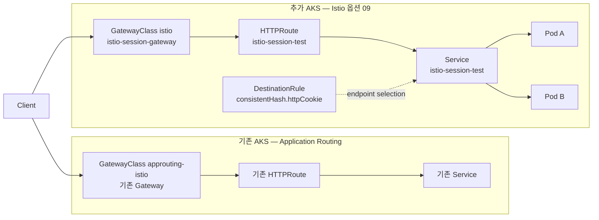

# 09 — Istio Gateway API 쿠키 일관 해시·응답 헤더·본문 검증 (옵션)

> 🟢 실행 = 직접 입력·수행 · 👁️ 예시 = 눈으로만(개념/발췌) · 📋 예상 출력 = 비교용(입력 불필요)

예상 소요 시간: 8–12분 (2026-08-12 Korea Central 리허설 실측: 원래 Gateway 보존 검증 포함 약 9분, 대부분 두 번째 AKS 클러스터 생성 대기)

> **독립 옵션 모듈**: [02 — 환경 준비](02-environment-setup.md) 이후 언제든 수행할 수 있습니다. 기존 `$CLUSTER`와 `approuting-istio` Gateway는 변경하지 않고, 같은 리소스 그룹에 Istio 전용 AKS 클러스터를 하나 더 만듭니다. 완료 후 원래 kubectl context로 복귀하므로 03–08을 계속 진행하거나 [10 — 정리](10-cleanup.md)로 이동할 수 있습니다.

이 옵션은 **원래 Application Routing 클러스터를 유지한 채**, 같은 리소스 그룹에 `aks-istio-$SUFFIX` 클러스터를 추가로 만들고 그 안에서 `GatewayClass/istio`, `HTTPRoute`, `DestinationRule`을 사용해 쿠키 기반 일관 해시와 **큰 응답 헤더·큰 응답 본문 동작**을 관찰하는 실험입니다. 이번 세션 테스트의 HTTP 요청·Gateway·Pod 관찰값은 모두 **새 Istio 클러스터**에서만 발생하며, 원래 `$CLUSTER`는 기준선 확인과 마지막 복귀 검증 용도로만 사용합니다.

👁️ **예시**


`DestinationRule`은 Kubernetes Service를 대체하는 리소스가 아니라, **Istio 프록시가 해당 Service의 엔드포인트를 어떤 규칙으로 고를지**를 정의합니다. 따라서 이번 모듈의 관찰 포인트는 “원래 `approuting-istio` 경로는 그대로 둔 채, 별도 Istio 클러스터에서 쿠키 기반 endpoint selection과 **응답 헤더·응답 본문 관찰**이 어떻게 보이느냐”입니다.

| 비교 항목 | `approuting-istio` | `istio` | 이번 모듈에서의 의미 |
|-----------|--------------------|---------|----------------------|
| AKS add-on 성격 | application routing add-on이 관리하는 Gateway API 전용 데이터 평면 | AKS Istio service mesh add-on | 두 구현을 **서로 다른 클러스터에서 병렬 비교**합니다 |
| Istio CRD | 제한적(일반적인 Istio CRD 없음) | `DestinationRule` 등 Istio CRD 지원 | 쿠키 일관 해시는 `DestinationRule`로 선언합니다 |
| 앱 파드 sidecar | 자동 주입 경로 없음 | 네임스페이스 라벨로 선택적 주입 가능 | 이번 모듈은 **앱 파드에 sidecar를 넣지 않습니다** |
| Gateway 리소스명 | 워크숍 기존 Gateway 이름 유지 | `istio-session-gateway` | 원래 Gateway와 별도 이름으로 공존합니다 |

두 클러스터를 유지한 채, 별도 Istio 클러스터에서 세션 정책과 응답 동작을 독립적으로 관찰합니다.

---

<details>
<summary>🔄 0단계 — 변수 재설정 (새 터미널/세션에서 시작하는 경우)</summary>

🟢 **실행**
```bash
cd ~
if [ -d ms-aks-approuting-workshop01/.git ]; then
  cd ms-aks-approuting-workshop01
  git pull --ff-only
else
  git clone https://github.com/jungwoonlee_microsoft/ms-aks-approuting-workshop01.git
  cd ms-aks-approuting-workshop01
fi
source ~/.approuting-ws-env
az aks get-credentials \
  --resource-group "$RESOURCE_GROUP" \
  --name "$CLUSTER" \
  --overwrite-existing
export ORIGINAL_CONTEXT=$(kubectl config current-context)
export ISTIO_CLUSTER="aks-istio-$SUFFIX"
export ORIGINAL_APP_ROUTING_MODE=$(az aks show \
  --resource-group "$RESOURCE_GROUP" \
  --name "$CLUSTER" \
  --query 'ingressProfile.webAppRouting.gatewayApiImplementations.appRoutingIstio.mode' \
  -o tsv)
echo "RESOURCE_GROUP=$RESOURCE_GROUP  LOCATION=$LOCATION"
echo "ORIGINAL_CLUSTER=$CLUSTER  ORIGINAL_CONTEXT=$ORIGINAL_CONTEXT"
echo "ISTIO_CLUSTER=$ISTIO_CLUSTER  APP_NAMESPACE=$APP_NAMESPACE"
echo "ORIGINAL_APP_ROUTING_MODE=$ORIGINAL_APP_ROUTING_MODE"
[ "$ORIGINAL_APP_ROUTING_MODE" = "Enabled" ] || {
  echo "기존 클러스터의 Application Routing Istio가 Enabled 상태가 아닙니다."
  exit 1
}
kubectl get gatewayclass approuting-istio
kubectl get gateway -A
```

</details>

02 직후에는 `kubectl get gateway -A` 결과가 비어 있을 수 있습니다. `Application Routing Istio=Enabled`와 `GatewayClass/approuting-istio Accepted=True`가 확인되면 다음 단계로 진행합니다.

📋 **예상 출력**
```text
RESOURCE_GROUP=rg-approuting-ws-35448  LOCATION=koreacentral
ORIGINAL_CLUSTER=aks-approuting-ws-35448  ORIGINAL_CONTEXT=aks-approuting-ws-35448
ISTIO_CLUSTER=aks-istio-35448  APP_NAMESPACE=workshop
ORIGINAL_APP_ROUTING_MODE=Enabled
NAME              CONTROLLER                               ACCEPTED   AGE
approuting-istio  istio.aks.azure.com/gateway-controller   True       1h
No resources found
```

---

## 1. 별도 Istio 클러스터 선택 — 기존 호환 클러스터 재사용 또는 새로 생성

같은 이름의 `$ISTIO_CLUSTER`가 이미 있으면 먼저 재사용 가능한지 확인하고, 없으면 Korea Central의 기본 AKS 버전과 호환되는 Istio revision으로 새 클러스터를 만듭니다. 아래 블록은 **재사용 경로와 신규 생성 경로를 한 번에 처리**합니다.

⏳ **기다리는 동안 읽기**: `az aks create`가 이 모듈의 가장 긴 대기 구간입니다. 새 클러스터가 올라오는 동안 아래 3–4절에 있는 `manifests/istio-session-test-app.yaml`과 `manifests/istio-session-test-routing.yaml` 전체 예시를 먼저 읽어 두면, 이후 apply 단계에서 각 필드의 의미를 빠르게 확인할 수 있습니다.

🟢 **실행**
```bash
if az aks show \
  --resource-group "$RESOURCE_GROUP" \
  --name "$ISTIO_CLUSTER" \
  -o none 2>/dev/null; then
  echo "기존 Istio 옵션 클러스터를 재사용합니다: $ISTIO_CLUSTER"
else
  export ISTIO_K8S_VERSION=$(az aks get-versions \
    --location "$LOCATION" \
    --query "values[?isDefault].version | [0]" \
    -o tsv)
  export ISTIO_MINOR=$(echo "$ISTIO_K8S_VERSION" | cut -d. -f1-2)
  export REVISION=$(az aks mesh get-revisions \
    --location "$LOCATION" \
    --query "meshRevisions[?compatibleWith[?name=='KubernetesOfficial' && contains(versions, '$ISTIO_MINOR')]].revision | [-1]" \
    -o tsv)
  echo "ISTIO_K8S_VERSION=$ISTIO_K8S_VERSION  REVISION=$REVISION"
  [ -n "$ISTIO_K8S_VERSION" ] && [[ "$REVISION" =~ ^asm-1-([0-9]+)$ ]] \
    && [ "${BASH_REMATCH[1]}" -ge 26 ] || {
    echo "Korea Central 기본 AKS 버전과 호환되는 asm-1-26 이상 revision을 찾지 못했습니다."
    exit 1
  }

  az aks create \
    --resource-group "$RESOURCE_GROUP" \
    --name "$ISTIO_CLUSTER" \
    --location "$LOCATION" \
    --kubernetes-version "$ISTIO_K8S_VERSION" \
    --node-count 2 \
    --node-vm-size Standard_D2s_v5 \
    --enable-gateway-api \
    --enable-asm \
    --revision "$REVISION" \
    --generate-ssh-keys
fi

export ISTIO_K8S_VERSION=$(az aks show \
  --resource-group "$RESOURCE_GROUP" \
  --name "$ISTIO_CLUSTER" \
  --query kubernetesVersion -o tsv)
export REVISION=$(az aks show \
  --resource-group "$RESOURCE_GROUP" \
  --name "$ISTIO_CLUSTER" \
  --query 'serviceMeshProfile.istio.revisions[0]' -o tsv)
[[ "$REVISION" =~ ^asm-1-([0-9]+)$ ]] && [ "${BASH_REMATCH[1]}" -ge 26 ] || {
  echo "기존 또는 신규 클러스터의 Istio revision이 asm-1-26 이상이 아닙니다."
  exit 1
}
echo "EFFECTIVE_K8S_VERSION=$ISTIO_K8S_VERSION  EFFECTIVE_REVISION=$REVISION"
```

🟢 **실행**
```bash
sed -i \
  -e '/^export ISTIO_CLUSTER=/d' \
  -e '/^export ISTIO_K8S_VERSION=/d' \
  -e '/^export REVISION=/d' \
  ~/.approuting-ws-env
printf 'export ISTIO_CLUSTER=%q\n' "$ISTIO_CLUSTER" >> ~/.approuting-ws-env
printf 'export ISTIO_K8S_VERSION=%q\n' "$ISTIO_K8S_VERSION" >> ~/.approuting-ws-env
printf 'export REVISION=%q\n' "$REVISION" >> ~/.approuting-ws-env
```

📋 **예상 출력**
```text
ISTIO_K8S_VERSION=1.35  REVISION=asm-1-30
EFFECTIVE_K8S_VERSION=1.35  EFFECTIVE_REVISION=asm-1-30
```

이미 같은 이름의 클러스터가 있더라도, 마지막 fail-fast 검사가 **Istio mode 여부와 `asm-1-26` 이상 revision 여부**를 강제로 확인합니다. 즉, 이름만 같고 호환되지 않는 클러스터는 여기서 바로 중단됩니다.

---

## 2. 두 번째 클러스터 자격 증명, control plane, 네임스페이스 준비

이제 kubectl context를 `$ISTIO_CLUSTER`로 전환하고, Istio control plane·Gateway API CRD·`DestinationRule` CRD·앱 네임스페이스의 uninjected 상태를 한 번에 확인합니다.

🟢 **실행**
```bash
az aks get-credentials \
  --resource-group "$RESOURCE_GROUP" \
  --name "$ISTIO_CLUSTER" \
  --context "$ISTIO_CLUSTER" \
  --overwrite-existing
kubectl config use-context "$ISTIO_CLUSTER"
[ "$(az aks show -g "$RESOURCE_GROUP" -n "$ISTIO_CLUSTER" \
  --query 'serviceMeshProfile.mode' -o tsv)" = "Istio" ] || {
  echo "두 번째 클러스터의 Istio service mesh add-on이 활성화되지 않았습니다."
  exit 1
}
kubectl wait \
  --for=condition=Accepted=True \
  gatewayclass/istio \
  --timeout=300s
kubectl get crd \
  gateways.gateway.networking.k8s.io \
  httproutes.gateway.networking.k8s.io \
  destinationrules.networking.istio.io
export REVISION_ISTIOD_RUNNING=$(kubectl get pods \
  -n aks-istio-system \
  -l app=istiod \
  --field-selector=status.phase=Running \
  -o name | grep -Ec "^pod/istiod-$REVISION-")
echo "REVISION_ISTIOD_RUNNING=$REVISION_ISTIOD_RUNNING"
[ "$REVISION_ISTIOD_RUNNING" -ge 1 ] || {
  echo "요청 revision의 Running istiod 파드를 찾지 못했습니다."
  exit 1
}
kubectl create namespace "$APP_NAMESPACE" \
  --dry-run=client -o yaml | kubectl apply -f -
kubectl label namespace "$APP_NAMESPACE" istio.io/rev- 2>/dev/null || true
kubectl label namespace "$APP_NAMESPACE" istio-injection- 2>/dev/null || true
kubectl get gatewayclass istio
kubectl get pods -n aks-istio-system
kubectl get namespace "$APP_NAMESPACE" --show-labels
```

진행 기준은 다음 다섯 가지입니다.

1. `serviceMeshProfile.mode=Istio`
2. `GatewayClass/istio Accepted=True`
3. Gateway API CRD와 `DestinationRule` CRD 존재
4. `istiod-$REVISION` Running Pod 최소 1개
5. `$APP_NAMESPACE`가 존재하고 injection 라벨이 없음

📋 **예상 출력**
```text
gatewayclass.gateway.networking.k8s.io/istio condition met
NAME                                   CREATED AT
gateways.gateway.networking.k8s.io     2026-08-12T06:10:34Z
httproutes.gateway.networking.k8s.io   2026-08-12T06:10:34Z
destinationrules.networking.istio.io   2026-08-12T06:10:34Z
REVISION_ISTIOD_RUNNING=2
NAME    CONTROLLER                  ACCEPTED   AGE
istio   istio.io/gateway-controller True       13m
```

2026-08-12 Korea Central 리허설에서는 `istiod-$REVISION` 2개가 모두 `Running`이었고 `Pending`은 0개였습니다. 따라서 이 모듈은 기본 2노드 구성만으로 끝까지 진행됐고, 9절의 스케일 명령은 사용하지 않았습니다.

---

## 3. 테스트 애플리케이션 매니페스트 확인 후 배포

앱 매니페스트는 **별도 이미지 빌드 없이** Pod identity와 큰 응답 헤더·본문을 반환하는 테스트 서버를 ConfigMap으로 제공하고, 파드를 2개 띄워 쿠키 기반 선택과 재매핑을 관찰할 수 있게 합니다.

<details>
<summary>👁️ 테스트 애플리케이션 전체 YAML 보기</summary>

👁️ **예시** — `manifests/istio-session-test-app.yaml` 전체
```yaml
apiVersion: v1
kind: ConfigMap
metadata:
  name: istio-session-test
data:
  server.py: |
    import json
    import os
    from http.server import BaseHTTPRequestHandler, ThreadingHTTPServer
    from urllib.parse import parse_qs, urlparse

    POD_NAME = os.environ["POD_NAME"]
    ALLOWED_SIZE_KIB = {8, 16, 32}


    class Handler(BaseHTTPRequestHandler):
        def send_json(self, status, payload, large_header_bytes=0):
            body = json.dumps(payload, separators=(",", ":")).encode()
            self.send_response(status)
            self.send_header("Content-Type", "application/json")
            self.send_header("Content-Length", str(len(body)))
            self.send_header("X-Workshop-Pod", POD_NAME)
            if large_header_bytes:
                self.send_header("X-Workshop-Large-Header", "x" * large_header_bytes)
            self.end_headers()
            self.wfile.write(body)

        def send_bytes(self, status, body):
            self.send_response(status)
            self.send_header("Content-Type", "application/octet-stream")
            self.send_header("Content-Length", str(len(body)))
            self.send_header("X-Workshop-Pod", POD_NAME)
            self.end_headers()
            self.wfile.write(body)

        def parse_size_kib(self, request):
            values = parse_qs(request.query).get("size", [])
            try:
                size_kib = int(values[0])
            except (IndexError, ValueError):
                self.send_json(400, {"error": "size must be 8, 16, or 32"})
                return None
            if size_kib not in ALLOWED_SIZE_KIB:
                self.send_json(400, {"error": "size must be 8, 16, or 32"})
                return None
            return size_kib

        def do_GET(self):
            request = urlparse(self.path)
            if request.path == "/healthz":
                self.send_json(200, {"status": "ok", "pod": POD_NAME})
                return
            if request.path == "/identity":
                self.send_json(200, {"pod": POD_NAME})
                return
            if request.path == "/headers":
                size_kib = self.parse_size_kib(request)
                if size_kib is None:
                    return
                self.send_json(
                    200,
                    {"pod": POD_NAME, "header_kib": size_kib},
                    large_header_bytes=size_kib * 1024,
                )
                return
            if request.path == "/body":
                size_kib = self.parse_size_kib(request)
                if size_kib is None:
                    return
                self.send_bytes(200, b"x" * (size_kib * 1024))
                return
            self.send_json(404, {"error": "not found"})

        def log_message(self, format, *args):
            print(f"{self.client_address[0]} {format % args}", flush=True)


    ThreadingHTTPServer(("0.0.0.0", 8080), Handler).serve_forever()
---
apiVersion: apps/v1
kind: Deployment
metadata:
  name: istio-session-test
spec:
  replicas: 2
  selector:
    matchLabels:
      app: istio-session-test
  template:
    metadata:
      labels:
        app: istio-session-test
    spec:
      securityContext:
        runAsNonRoot: true
        runAsUser: 1000
        runAsGroup: 1000
        fsGroup: 1000
      containers:
      - name: app
        image: python:3.12-alpine
        command: ["python", "/app/server.py"]
        env:
        - name: POD_NAME
          valueFrom:
            fieldRef:
              fieldPath: metadata.name
        ports:
        - name: http
          containerPort: 8080
        readinessProbe:
          httpGet:
            path: /healthz
            port: http
          initialDelaySeconds: 2
          periodSeconds: 3
        livenessProbe:
          httpGet:
            path: /healthz
            port: http
          initialDelaySeconds: 5
          periodSeconds: 10
        resources:
          requests:
            cpu: 20m
            memory: 32Mi
          limits:
            cpu: 100m
            memory: 64Mi
        securityContext:
          allowPrivilegeEscalation: false
          capabilities:
            drop: ["ALL"]
        volumeMounts:
        - name: app
          mountPath: /app
          readOnly: true
      volumes:
      - name: app
        configMap:
          name: istio-session-test
---
apiVersion: v1
kind: Service
metadata:
  name: istio-session-test
spec:
  selector:
    app: istio-session-test
  ports:
  - name: http
    port: 80
    targetPort: http
```

</details>

| 필드 | 역할 |
|------|------|
| `ConfigMap.data.server.py` | 별도 이미지 빌드 없이 Pod identity와 큰 응답 헤더·본문을 반환하는 테스트 서버를 제공합니다 |
| `replicas: 2` | 서로 다른 두 엔드포인트에서 쿠키 기반 선택과 재매핑을 관찰합니다 |
| `POD_NAME` downward API | 응답 JSON과 `X-Workshop-Pod` 헤더에 실제 Pod 이름을 넣습니다 |
| `/identity` | 현재 선택된 Pod를 JSON으로 반환합니다 |
| `/headers?size=8\|16\|32` | 허용된 크기의 `X-Workshop-Large-Header` 응답 헤더를 생성합니다 |
| `/body?size=8\|16\|32` | 허용된 크기의 응답 본문을 정확히 `size * 1024` bytes로 반환합니다 |
| non-root `securityContext` | 테스트 컨테이너를 root 권한 없이 실행합니다 |
| `Service/istio-session-test:80` | HTTPRoute와 DestinationRule이 공통으로 참조하는 백엔드입니다 |

🟢 **실행**
```bash
kubectl apply \
  -n "$APP_NAMESPACE" \
  -f manifests/istio-session-test-app.yaml
kubectl rollout status deployment/istio-session-test \
  -n "$APP_NAMESPACE" \
  --timeout=300s
kubectl get pods \
  -n "$APP_NAMESPACE" \
  -l app=istio-session-test
```

앱 파드 두 개가 모두 `1/1`이어야 정상입니다. `2/2`로 보이면 sidecar가 주입된 것이므로, 아래 트러블슈팅의 namespace label 점검으로 돌아가세요.

📋 **예상 출력**
```text
configmap/istio-session-test created
deployment.apps/istio-session-test created
service/istio-session-test created
deployment "istio-session-test" successfully rolled out
NAME                                  READY   STATUS    RESTARTS   AGE
istio-session-test-8649fc85c6-2vkcp   1/1     Running   0          12s
istio-session-test-8649fc85c6-92pbm   1/1     Running   0          12s
```

---

## 4. 라우팅 매니페스트 확인 후 배포

이제 Gateway·HTTPRoute·DestinationRule을 한 번에 적용합니다. `Gateway`는 `$REVISION`에 고정되고, `DestinationRule`은 `workshop-session` 쿠키를 endpoint 선택 키로 사용합니다.

👁️ **예시** — `manifests/istio-session-test-routing.yaml` 전체
```yaml
apiVersion: gateway.networking.k8s.io/v1
kind: Gateway
metadata:
  name: istio-session-gateway
  labels:
    istio.io/rev: ${REVISION}
spec:
  gatewayClassName: istio
  listeners:
  - name: http
    port: 80
    protocol: HTTP
    allowedRoutes:
      namespaces:
        from: Same
---
apiVersion: gateway.networking.k8s.io/v1
kind: HTTPRoute
metadata:
  name: istio-session-test
spec:
  parentRefs:
  - name: istio-session-gateway
  rules:
  - matches:
    - path:
        type: PathPrefix
        value: /
    backendRefs:
    - name: istio-session-test
      port: 80
---
apiVersion: networking.istio.io/v1
kind: DestinationRule
metadata:
  name: istio-session-test
spec:
  host: istio-session-test
  trafficPolicy:
    loadBalancer:
      consistentHash:
        httpCookie:
          name: workshop-session
          path: /
          ttl: 0s
```

| 필드 | 역할 |
|------|------|
| `gatewayClassName: istio` | 두 번째 클러스터의 AKS Istio service mesh GatewayClass를 사용합니다 |
| `istio.io/rev: ${REVISION}` | 여러 revision이 공존할 때 이 Gateway를 소유할 control plane revision을 고정합니다 |
| `allowedRoutes.namespaces.from: Same` | 같은 네임스페이스의 HTTPRoute만 Gateway에 연결합니다 |
| `parentRefs[].name` | HTTPRoute를 `istio-session-gateway`에 연결합니다 |
| `backendRefs[].name/port` | 요청을 `istio-session-test:80`으로 전달합니다 |
| `DestinationRule.spec.host` | 정책을 동일한 Service 이름에 적용합니다 |
| `consistentHash.httpCookie.name` | `workshop-session` 쿠키 값을 endpoint 선택 키로 사용합니다 |
| `ttl: 0s` | 브라우저 종료 시 사라지는 세션 쿠키로 발급합니다 |

파일에는 `${REVISION}` 문자열이 그대로 들어 있습니다. 아래 `envsubst`가 현재 클러스터에 설치된 revision 값으로 치환한 결과를 `kubectl apply`에 전달합니다.

🟢 **실행**
```bash
envsubst < manifests/istio-session-test-routing.yaml |
  kubectl apply -n "$APP_NAMESPACE" -f -
kubectl wait \
  --for=condition=Programmed=True \
  gateway/istio-session-gateway \
  -n "$APP_NAMESPACE" \
  --timeout=300s
kubectl get gateway,httproute,destinationrule \
  -n "$APP_NAMESPACE"
kubectl get httproute istio-session-test \
  -n "$APP_NAMESPACE" \
  -o jsonpath='{range .status.parents[0].conditions[*]}{.type}={.status}{"\n"}{end}'
export ISTIO_GATEWAY_IP=$(kubectl get gateway istio-session-gateway \
  -n "$APP_NAMESPACE" \
  -o jsonpath='{.status.addresses[0].value}')
echo "ISTIO_GATEWAY_IP=$ISTIO_GATEWAY_IP"
```

다음 네 가지가 모두 충족돼야 트래픽 테스트로 넘어갑니다.

1. `Gateway/istio-session-gateway Programmed=True`
2. `HTTPRoute Accepted=True`
3. `HTTPRoute ResolvedRefs=True`
4. `ISTIO_GATEWAY_IP`가 비어 있지 않음

📋 **예상 출력**
```text
gateway.gateway.networking.k8s.io/istio-session-gateway created
httproute.gateway.networking.k8s.io/istio-session-test created
destinationrule.networking.istio.io/istio-session-test created
gateway.gateway.networking.k8s.io/istio-session-gateway condition met
NAME                                             CLASS   ADDRESS        PROGRAMMED   AGE
gateway.gateway.networking.k8s.io/istio-session-gateway   istio   20.249.51.44   True         31s
NAME                                                 HOSTNAMES   AGE
httproute.gateway.networking.k8s.io/istio-session-test                31s
NAME                                               HOST                AGE
destinationrule.networking.istio.io/istio-session-test   istio-session-test   31s
Accepted=True
ResolvedRefs=True
ISTIO_GATEWAY_IP=20.249.51.44
```

---

## 5. 첫 응답에서 쿠키 발급, 같은 세션에서 파드 반복 선택 확인

첫 요청은 `Set-Cookie: workshop-session=...` 발급 여부를 보고, 이후 다섯 번의 재요청이 모두 같은 파드를 가리키는지 확인합니다.

🟢 **실행**
```bash
export COOKIE_JAR=$(mktemp)
export RESPONSE_HEADERS=$(mktemp)
export RESPONSE_BODY=$(mktemp)
curl -sS -D "$RESPONSE_HEADERS" -c "$COOKIE_JAR" \
  "http://$ISTIO_GATEWAY_IP/identity" -o "$RESPONSE_BODY"
grep -i '^set-cookie: workshop-session=' "$RESPONSE_HEADERS"
cat "$RESPONSE_BODY"; echo
for i in $(seq 1 5); do
  curl -sS -b "$COOKIE_JAR" "http://$ISTIO_GATEWAY_IP/identity" |
    jq -r .pod
done
```

📋 **예상 출력**
```text
set-cookie: workshop-session="6fe38894f0c3370c"; Path=/; HttpOnly
{"pod":"istio-session-test-8649fc85c6-92pbm"}
istio-session-test-8649fc85c6-92pbm
istio-session-test-8649fc85c6-92pbm
istio-session-test-8649fc85c6-92pbm
istio-session-test-8649fc85c6-92pbm
istio-session-test-8649fc85c6-92pbm
```

여기서 `ttl: 0s`는 만료 시각을 고정하지 않는 **세션 쿠키**라는 뜻입니다. 같은 cookie jar를 계속 쓰는 동안에는 같은 파드가 반복 선택되지만, 브라우저를 닫거나 jar를 버리면 새로운 세션으로 다시 분산될 수 있습니다.

---

## 6. 독립 세션 분산과 장애 후 재매핑 확인

### 6.1 서로 다른 쿠키 세션 20개로 분산 확인

이번에는 각 요청이 서로 다른 cookie jar를 갖도록 하여 분산 결과를 봅니다. 두 파드가 모두 준비되어 있다면 표본 20개 안에서 보통 둘 다 관측됩니다.

🟢 **실행**
```bash
export COOKIE_DIR=$(mktemp -d)
for i in $(seq 1 20); do
  curl -sS -c "$COOKIE_DIR/session-$i.txt" \
    "http://$ISTIO_GATEWAY_IP/identity" |
    jq -r .pod
done | sort | uniq -c
```

📋 **예상 출력**
```text
     14 istio-session-test-8649fc85c6-2vkcp
      6 istio-session-test-8649fc85c6-92pbm
```

분산은 확률적입니다. 운이 나쁘면 20개 표본에서도 한 파드만 보일 수 있으므로, 그런 경우에는 먼저 **준비된 엔드포인트가 실제로 2개인지** 확인하고 새 jar 20개로 한 번 더 반복합니다.

🟢 **실행**
```bash
kubectl get endpointslice -n "$APP_NAMESPACE" \
  -l kubernetes.io/service-name=istio-session-test
```

### 6.2 처음 선택된 sticky 파드를 지운 뒤 같은 쿠키가 다른 파드로 재매핑되는지 확인

🟢 **실행**
```bash
export STICKY_POD=$(curl -fsS --max-time 5 -b "$COOKIE_JAR" \
  "http://$ISTIO_GATEWAY_IP/identity" |
  jq -er '.pod | select(type == "string" and length > 0)') || {
  echo "삭제할 sticky 파드 이름을 확인하지 못했습니다."
  exit 1
}
kubectl delete pod "$STICKY_POD" -n "$APP_NAMESPACE"
export REMAPPED_POD=""
for ATTEMPT in $(seq 1 30); do
  REMAPPED_POD=$(curl -fsS --max-time 5 -b "$COOKIE_JAR" \
    "http://$ISTIO_GATEWAY_IP/identity" 2>/dev/null |
    jq -er '.pod | select(type == "string" and length > 0)' 2>/dev/null) || true
  if [ -n "$REMAPPED_POD" ] && [ "$STICKY_POD" != "$REMAPPED_POD" ]; then
    break
  fi
  sleep 2
done
echo "before=$STICKY_POD  after=$REMAPPED_POD"
[ -n "$REMAPPED_POD" ] && [ "$STICKY_POD" != "$REMAPPED_POD" ] || {
  echo "60초 안에 정상 파드로 재매핑되지 않았습니다."
  exit 1
}
```

📋 **예상 출력**
```text
pod "istio-session-test-8649fc85c6-92pbm" deleted
before=istio-session-test-8649fc85c6-92pbm  after=istio-session-test-8649fc85c6-pcn8p
```

삭제 직후에는 EndpointSlice와 Envoy 설정 전파 중에 일시적인 503 또는 연결 실패가 발생할 수 있으므로, 최대 60초 동안 **HTTP 성공 응답의 비어 있지 않은 파드 이름**을 기다립니다. 빈 응답이나 JSON 파싱 실패는 재매핑 성공으로 인정하지 않습니다.

이 재매핑이 이번 실험의 핵심 차이입니다. 즉, 이 방식은 “한 번 정해진 세션이 절대 바뀌지 않는 외부 저장소형 매핑”이 아니라, **현재 엔드포인트 집합에 대한 consistent hash** 입니다. 따라서 파드가 사라지거나 새 파드로 교체되면 같은 쿠키라도 다른 대상이 선택될 수 있습니다.

---

## 7. 8/16/32 KiB 큰 응답 헤더와 본문 관찰

이 절은 `/headers?size=8|16|32`와 `/body?size=8|16|32`를 각각 호출해 **응답 헤더 크기**와 **응답 본문 크기**를 따로 관찰하는 실험입니다. 앱은 헤더 테스트에서 `X-Workshop-Large-Header`를, 본문 테스트에서 정확히 `size * 1024` bytes의 payload를 반환하고, 우리는 각 경우의 HTTP 상태 코드와 실제 바이트 수를 기록합니다.

NGINX에서 사용하던 세 설정의 역할은 서로 다릅니다.

- `nginx.ingress.kubernetes.io/proxy-buffer-size`: 업스트림 응답의 첫 부분, 특히 큰 응답 헤더를 읽는 버퍼입니다. 아래 **헤더 테스트**가 직접 대응합니다.
- `nginx.ingress.kubernetes.io/proxy-buffers`: 업스트림 응답 본문을 저장하는 버퍼 수와 크기를 제어합니다. 아래 **본문 테스트**는 이 영역을 관찰하는 출발점입니다.
- `nginx.ingress.kubernetes.io/proxy-busy-buffers-size`: 클라이언트로 전송 중인 응답 버퍼의 최대 크기를 제어합니다. 역시 **본문 전달 과정**과 관련이 있습니다.

이번 테스트는 고정 크기 응답의 상태 코드와 바이트 수를 확인합니다. `proxy-buffer-size`는 헤더 결과와, `proxy-buffers`·`proxy-busy-buffers-size`는 본문 결과와 비교할 수 있으며, streaming/busy-buffer 동작은 별도 부하·스트리밍 시험으로 확인합니다.

### 7.1 큰 응답 헤더 관찰

🟢 **실행**
```bash
for SIZE in 8 16 32; do
  HEADER_FILE=$(mktemp)
  BODY_FILE=$(mktemp)
  HTTP_CODE=$(curl -sS --max-time 15 \
    -D "$HEADER_FILE" \
    -o "$BODY_FILE" \
    -w '%{http_code}' \
    "http://$ISTIO_GATEWAY_IP/headers?size=$SIZE")
  HEADER_BYTES=$(LC_ALL=C awk '
    BEGIN { IGNORECASE=1 }
    /^X-Workshop-Large-Header:/ {
      sub(/\r$/, "")
      sub(/^[^:]*: /, "")
      print length($0)
    }' "$HEADER_FILE")
  POD=$(LC_ALL=C awk '
    BEGIN { IGNORECASE=1 }
    /^X-Workshop-Pod:/ {
      sub(/\r$/, "")
      sub(/^[^:]*: /, "")
      print
    }' "$HEADER_FILE")
  printf '%s KiB: status=%s header_bytes=%s pod=%s\n' \
    "$SIZE" "$HTTP_CODE" "$HEADER_BYTES" "$POD"
  rm -f "$HEADER_FILE" "$BODY_FILE"
done
```

📋 **예상 출력**
```text
8 KiB: status=200 header_bytes=8192 pod=istio-session-test-<pod-name>
16 KiB: status=200 header_bytes=16384 pod=istio-session-test-<pod-name>
32 KiB: status=200 header_bytes=32768 pod=istio-session-test-<pod-name>
```

2026-08-12 Korea Central focused live 검증에서 세 크기 모두 HTTP `200`과 정확한 헤더 바이트 수를 확인했습니다. sticky cookie를 재사용하지 않으므로 요청마다 선택된 Pod는 달라질 수 있습니다.

### 7.2 큰 응답 본문 관찰

🟢 **실행**
```bash
for SIZE in 8 16 32; do
  HEADER_FILE=$(mktemp)
  BODY_FILE=$(mktemp)
  HTTP_CODE=$(curl -sS --max-time 15 \
    -D "$HEADER_FILE" \
    -o "$BODY_FILE" \
    -w '%{http_code}' \
    "http://$ISTIO_GATEWAY_IP/body?size=$SIZE")
  BODY_BYTES=$(wc -c < "$BODY_FILE" | tr -d ' ')
  POD=$(LC_ALL=C awk '
    BEGIN { IGNORECASE=1 }
    /^X-Workshop-Pod:/ {
      sub(/\r$/, "")
      sub(/^[^:]*: /, "")
      print
    }' "$HEADER_FILE")
  printf '%s KiB: status=%s body_bytes=%s pod=%s\n' \
    "$SIZE" "$HTTP_CODE" "$BODY_BYTES" "$POD"
  rm -f "$HEADER_FILE" "$BODY_FILE"
done
rm -f "$COOKIE_JAR" "$RESPONSE_HEADERS" "$RESPONSE_BODY"
rm -rf "$COOKIE_DIR"
```

📋 **예상 출력**
```text
8 KiB: status=200 body_bytes=8192 pod=istio-session-test-<pod-name>
16 KiB: status=200 body_bytes=16384 pod=istio-session-test-<pod-name>
32 KiB: status=200 body_bytes=32768 pod=istio-session-test-<pod-name>
```

위 세 줄은 **2026-08-12 Korea Central focused live 검증에서 실제로 관찰한 요약값**입니다. `/body?size=8|16|32`는 모두 HTTP `200`을 반환했고, 본문 길이도 각각 `8192/16384/32768` bytes로 정확히 일치했습니다.

---

## 8. 결과 해석

| 질문 | 기록할 결과 |
|------|-------------|
| `DestinationRule`이 NGINX cookie affinity를 그대로 대체할 수 있는가? | 쿠키 키 기반의 일관 라우팅은 가능하지만, 완전히 동일한 영속 sticky semantics는 아닙니다 |
| `proxy-buffer-size` 없이 큰 응답 헤더를 처리할 수 있는가? | 리허설한 AKS/Istio 버전에서는 별도 NGINX annotation 없이 8/16/32 KiB 응답 헤더가 모두 200으로 관찰됐습니다 |
| `proxy-buffers`와 `proxy-busy-buffers-size`는 어떻게 관찰하는가? | `/body?size=8\|16\|32`로 고정 크기 본문 전달을 확인하고, streaming 동작은 별도 시험으로 확장합니다 |
| 엔드포인트가 바뀌면 어떤 일이 일어나는가? | 같은 쿠키라도 hash ring 멤버십 변화 때문에 다른 파드로 재매핑될 수 있습니다 |
| 이번 테스트의 트래픽 경로는 어디인가? | Gateway·HTTPRoute·DestinationRule·Pod 관찰값은 `$ISTIO_CLUSTER`에서 발생합니다 |

---

## 9. 필요할 때만 용량 회복

이 절은 `istiod` 또는 Gateway Pod가 `Pending`일 때 사용합니다. 2026-08-12 Korea Central 리허설에서는 기본 2노드로 완료했습니다.

🟢 **실행**
```bash
kubectl get pods -A --field-selector=status.phase=Pending
kubectl get events -A --sort-by=.lastTimestamp | tail -30
```

이벤트에서 `Unschedulable`와 `Insufficient cpu`가 함께 확인되면 3노드로 확장합니다. 다른 오류는 아래 트러블슈팅 표의 해당 진단을 따릅니다.

🟢 **실행**
```bash
az aks scale \
  --resource-group "$RESOURCE_GROUP" \
  --name "$ISTIO_CLUSTER" \
  --node-count 3
kubectl wait \
  --for=condition=Programmed=True \
  gateway/istio-session-gateway \
  -n "$APP_NAMESPACE" \
  --timeout=300s
```

---

## 10. 원래 클러스터 context 복귀와 불변성 검증

이 모듈의 마지막 단계는 **원래 클러스터가 실제로 바뀌지 않았는지** 다시 확인하는 것입니다. 모듈 09에서 만든 리소스는 `$ISTIO_CLUSTER`에 남아 있으며, [10 — 정리](10-cleanup.md)에서 함께 삭제합니다.

🟢 **실행**
```bash
kubectl config use-context "$ORIGINAL_CONTEXT"
export FINAL_APP_ROUTING_MODE=$(az aks show \
  --resource-group "$RESOURCE_GROUP" \
  --name "$CLUSTER" \
  --query 'ingressProfile.webAppRouting.gatewayApiImplementations.appRoutingIstio.mode' \
  -o tsv)
echo "BEFORE=$ORIGINAL_APP_ROUTING_MODE  AFTER=$FINAL_APP_ROUTING_MODE"
[ "$FINAL_APP_ROUTING_MODE" = "$ORIGINAL_APP_ROUTING_MODE" ] || {
  echo "기존 클러스터의 Application Routing 상태가 달라졌습니다."
  exit 1
}
kubectl get gatewayclass approuting-istio
kubectl get gateway -A
kubectl config current-context
```

📋 **예상 출력**
```text
Switched to context "aks-approuting-ws-35448".
BEFORE=Enabled  AFTER=Enabled
NAME              CONTROLLER                               ACCEPTED   AGE
approuting-istio  istio.aks.azure.com/gateway-controller   True       2h
No resources found
aks-approuting-ws-35448
```

03을 이미 수행했다면 `No resources found` 대신 기존 Gateway 목록이 보일 수 있습니다. 그 경우에도 **모듈 09 전후로 같은 Gateway 상태가 유지되는지**를 비교하면 됩니다.

원래 kubectl context로 돌아왔으면 03–08 실습을 계속 진행할 수 있고, 이번 모듈에서 만든 별도 Istio 클러스터 리소스는 10 모듈에서 정리하면 됩니다.

---

## 트러블슈팅

| 증상 | 원인 | 진단 | 조치 |
|------|------|------|------|
| `ISTIO_K8S_VERSION` 또는 `REVISION` 값이 비어 있음 | 지역 기본 버전 또는 호환 revision 조회가 실패함 | `az aks get-versions --location "$LOCATION" -o table`와 `az aks mesh get-revisions --location "$LOCATION" -o table`로 값을 다시 조회합니다 | 클러스터 생성 전에 중단하고, 지원되는 버전·revision 조합을 다시 선택합니다 |
| 기존 `$ISTIO_CLUSTER`가 `Istio` mode가 아니거나 revision이 `asm-1-26` 미만임 | 같은 이름의 비호환 클러스터가 이미 존재함 | `az aks show --resource-group "$RESOURCE_GROUP" --name "$ISTIO_CLUSTER" --query '{mode:serviceMeshProfile.mode, revision:serviceMeshProfile.istio.revisions[0], kubernetesVersion:kubernetesVersion}' -o yaml`로 상태를 확인합니다 | 새 `SUFFIX`를 사용해 다른 이름으로 만들거나, 기존 비호환 워크숍 클러스터를 제거한 뒤 다시 진행합니다 |
| `az aks create`가 quota 또는 SKU capacity 오류로 실패함 | `StandardDSv5Family` 쿼터 부족 또는 지역 용량 부족 | Azure 오류 메시지와 구독 quota 상태를 확인합니다 | quota 증가 요청 또는 승인된 용량으로 재시도하고, 원래 `$CLUSTER`는 수정하지 않습니다 |
| 요청한 revision의 `istiod`가 Running이 아님 | control plane 초기화 지연 또는 스케줄링 실패 | `kubectl get pods -n aks-istio-system`, `kubectl get events -n aks-istio-system --sort-by=.lastTimestamp \| tail -20`으로 원인을 봅니다 | 잠시 기다리고, `Unschedulable` + `Insufficient cpu`가 확인된 경우에만 9절의 scale 명령을 사용합니다 |
| 생성된 Gateway Pod가 `Pending`이거나 `Gateway/istio-session-gateway`가 `Programmed=False`로 머묾 | Gateway 프록시가 스케줄되지 못함 | `kubectl get deployment,service -n "$APP_NAMESPACE" istio-session-gateway-istio`, `kubectl get pods -n "$APP_NAMESPACE"`, `kubectl get events -n "$APP_NAMESPACE" --sort-by=.lastTimestamp \| tail -20`로 상태를 확인합니다 | `Unschedulable` + `Insufficient cpu`가 확인될 때만 9절의 scale 명령으로 3노드까지 늘립니다 |
| 테스트 파드가 `1/1`이 아니라 `2/2`로 표시됨 | namespace에 injection label이 남아 sidecar가 주입됨 | `kubectl get namespace "$APP_NAMESPACE" --show-labels`와 `kubectl get pods -n "$APP_NAMESPACE" -l app=istio-session-test`로 상태를 확인합니다 | `kubectl label namespace "$APP_NAMESPACE" istio.io/rev-`와 `kubectl label namespace "$APP_NAMESPACE" istio-injection-`로 라벨을 제거한 뒤 Deployment를 다시 시작합니다 |
| 쿠키가 발급되지 않거나, 20개 샘플에서 엔드포인트가 하나만 보이거나, 재매핑이 시간 안에 끝나지 않거나, 큰 헤더에서 non-200이 보임 | `DestinationRule` 적용 지연, ready endpoint 부족, 빈 응답/JSON 파싱 실패, 현재 버전의 헤더 한계 등 관찰값이 섞여 있음 | `grep -i '^set-cookie: workshop-session=' "$RESPONSE_HEADERS"`, `kubectl get endpointslice -n "$APP_NAMESPACE" -l kubernetes.io/service-name=istio-session-test`, 그리고 6–7절의 hardened curl/jq 명령으로 비어 있지 않은 파드 이름과 상태 코드를 다시 확인합니다 | 빈 출력에 성공 판정을 내리지 말고, 기존 hardened 명령을 유지한 채 쿠키·엔드포인트·재매핑·헤더 바이트 수를 다시 기록합니다 |
| 마지막 context 또는 profile 값이 시작 상태와 다름 | `ORIGINAL_CONTEXT`로 돌아오지 않았거나 원래 클러스터 profile이 외부에서 변경됨 | `kubectl config current-context`와 `echo "BEFORE=$ORIGINAL_APP_ROUTING_MODE  AFTER=$FINAL_APP_ROUTING_MODE"`를 비교합니다 | 먼저 `kubectl config use-context "$ORIGINAL_CONTEXT"`로 복귀하고, 값이 계속 다르면 원래 클러스터 profile drift를 별도로 진단합니다 |

---

[← 02 — 환경 준비](02-environment-setup.md) | 다음: [03 — Gateway·HTTPRoute로 HTTP 노출](03-gateway-httproute.md) 또는 [10 — 정리](10-cleanup.md)
